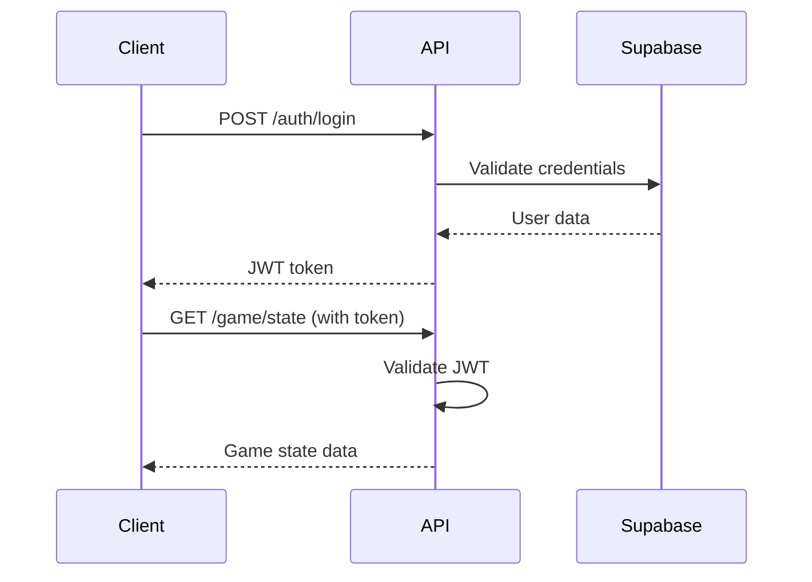

# 🔌 API Documentation

## Base URL

- **Production**: `https://api.llamawoolfarm.com`
- **Staging**: `https://api-staging.llamawoolfarm.com`
- **Development**: `http://localhost:3000`

## Authentication

All API endpoints require authentication using JWT tokens. Include the token in the Authorization header:

```javascript
Authorization: Bearer <your-jwt-token>
```

### Authentication Flow



## Response Format

All API responses follow this structure:

```javascript
{
  "success": true,
  "data": {
    // Response data
  },
  "message": "Success message",
  "timestamp": "2024-01-01T00:00:00Z"
}
```

Error responses:

```javascript
{
  "success": false,
  "error": {
    "code": "ERROR_CODE",
    "message": "Human-readable error message",
    "details": {}
  },
  "timestamp": "2024-01-01T00:00:00Z"
}
```

## Authentication Endpoints

### POST /auth/register

Register a new user account.

**Request Body:**
```javascript
{
  "email": "user@example.com",
  "password": "securepassword123",
  "username": "llamalover" // optional
}
```

**Response:**
```javascript
{
  "success": true,
  "data": {
    "user": {
      "id": "uuid",
      "email": "user@example.com",
      "username": "llamalover",
      "created_at": "2024-01-01T00:00:00Z"
    },
    "token": "jwt-token-here"
  },
  "message": "User registered successfully"
}
```

### POST /auth/login

Authenticate user and receive JWT token.

**Request Body:**
```javascript
{
  "email": "user@example.com",
  "password": "securepassword123"
}
```

**Response:**
```javascript
{
  "success": true,
  "data": {
    "user": {
      "id": "uuid",
      "email": "user@example.com",
      "username": "llamalover"
    },
    "token": "jwt-token-here",
    "expires_at": "2024-01-01T00:00:00Z"
  },
  "message": "Login successful"
}
```

### POST /auth/refresh

Refresh JWT token.

**Request Body:**
```javascript
{
  "refresh_token": "refresh-token-here"
}
```

**Response:**
```javascript
{
  "success": true,
  "data": {
    "token": "new-jwt-token",
    "expires_at": "2024-01-01T00:00:00Z"
  },
  "message": "Token refreshed successfully"
}
```

### POST /auth/logout

Logout user and invalidate token.

**Response:**
```javascript
{
  "success": true,
  "message": "Logout successful"
}
```

## Game State Endpoints

### GET /game/state

Get current game state for authenticated user.

**Response:**
```javascript
{
  "success": true,
  "data": {
    "game_state": {
      "id": "uuid",
      "user_id": "uuid",
      "wool_count": "1234567.89",
      "soul_shears": "123.45",
      "prestige_level": 2,
      "buildings": {
        "shearingStation": {
          "count": 5,
          "level": 3
        },
        "woolMill": {
          "count": 2,
          "level": 1
        }
      },
      "upgrades": {
        "sharpShears": true,
        "autoShearing": false
      },
      "last_offline_calculation": "2024-01-01T00:00:00Z",
      "created_at": "2024-01-01T00:00:00Z",
      "updated_at": "2024-01-01T00:00:00Z"
    }
  },
  "message": "Game state retrieved successfully"
}
```

### PUT /game/state

Update game state for authenticated user.

**Request Body:**
```javascript
{
  "wool_count": "1234567.89",
  "soul_shears": "123.45",
  "prestige_level": 2,
  "buildings": {
    "shearingStation": {
      "count": 5,
      "level": 3
    }
  },
  "upgrades": {
    "sharpShears": true,
    "autoShearing": false
  }
}
```

**Response:**
```javascript
{
  "success": true,
  "data": {
    "game_state": {
      // Updated game state object
    }
  },
  "message": "Game state updated successfully"
}
```

### POST /game/offline-progress

Calculate offline progress for user.

**Request Body:**
```javascript
{
  "last_active": "2024-01-01T00:00:00Z"
}
```

**Response:**
```javascript
{
  "success": true,
  "data": {
    "offline_progress": {
      "wool_earned": "12345.67",
      "time_offline": 3600, // seconds
      "max_offline_time": 86400, // seconds
      "buildings_production": {
        "shearingStation": "5432.10",
        "woolMill": "7890.12"
      }
    }
  },
  "message": "Offline progress calculated successfully"
}
```

### POST /game/prestige

Perform prestige action (reset with bonuses).

**Request Body:**
```javascript
{
  "confirm": true
}
```

**Response:**
```javascript
{
  "success": true,
  "data": {
    "prestige_result": {
      "soul_shears_gained": "45.67",
      "new_prestige_level": 3,
      "multiplier_bonus": 1.5,
      "reset_timestamp": "2024-01-01T00:00:00Z"
    }
  },
  "message": "Prestige completed successfully"
}
```

## Player Endpoints

### GET /players/profile

Get player profile information.

**Response:**
```javascript
{
  "success": true,
  "data": {
    "profile": {
      "id": "uuid",
      "username": "llamalover",
      "email": "user@example.com",
      "total_wool_produced": "9876543.21",
      "total_prestiges": 5,
      "achievements": [
        {
          "id": "first_prestige",
          "name": "First Prestige",
          "description": "Perform your first prestige",
          "unlocked_at": "2024-01-01T00:00:00Z"
        }
      ],
      "statistics": {
        "play_time": 360000, // seconds
        "llamas_owned": 42,
        "buildings_built": 156
      },
      "created_at": "2024-01-01T00:00:00Z",
      "updated_at": "2024-01-01T00:00:00Z"
    }
  },
  "message": "Profile retrieved successfully"
}
```

### PUT /players/profile

Update player profile.

**Request Body:**
```javascript
{
  "username": "newusername",
  "preferences": {
    "theme": "dark",
    "notifications": true,
    "sound_enabled": true
  }
}
```

**Response:**
```javascript
{
  "success": true,
  "data": {
    "profile": {
      // Updated profile object
    }
  },
  "message": "Profile updated successfully"
}
```

### GET /players/achievements

Get player achievements.

**Response:**
```javascript
{
  "success": true,
  "data": {
    "achievements": [
      {
        "id": "first_llama",
        "name": "First Llama",
        "description": "Purchase your first llama",
        "unlocked": true,
        "unlocked_at": "2024-01-01T00:00:00Z",
        "reward": {
          "type": "wool",
          "amount": "100"
        }
      },
      {
        "id": "wool_millionaire",
        "name": "Wool Millionaire",
        "description": "Accumulate 1,000,000 wool",
        "unlocked": false,
        "progress": {
          "current": 456789,
          "target": 1000000
        }
      }
    ]
  },
  "message": "Achievements retrieved successfully"
}
```

## Leaderboard Endpoints

### GET /leaderboard/global

Get global leaderboard.

**Query Parameters:**
- `limit` (optional): Number of entries to return (default: 100, max: 500)
- `offset` (optional): Offset for pagination (default: 0)
- `type` (optional): Leaderboard type - "wool" or "prestige" (default: "wool")

**Response:**
```javascript
{
  "success": true,
  "data": {
    "leaderboard": [
      {
        "rank": 1,
        "user_id": "uuid",
        "username": "topplayer",
        "wool_count": "9999999999.99",
        "prestige_level": 10,
        "updated_at": "2024-01-01T00:00:00Z"
      },
      {
        "rank": 2,
        "user_id": "uuid",
        "username": "secondplace",
        "wool_count": "5555555555.55",
        "prestige_level": 8,
        "updated_at": "2024-01-01T00:00:00Z"
      }
    ],
    "pagination": {
      "total": 1000,
      "limit": 100,
      "offset": 0,
      "has_next": true
    },
    "user_rank": {
      "rank": 42,
      "wool_count": "1234567.89",
      "prestige_level": 3
    }
  },
  "message": "Leaderboard retrieved successfully"
}
```

### GET /leaderboard/friends

Get friends leaderboard.

**Response:**
```javascript
{
  "success": true,
  "data": {
    "leaderboard": [
      {
        "rank": 1,
        "user_id": "uuid",
        "username": "bestfriend",
        "wool_count": "2345678.90",
        "prestige_level": 4,
        "is_friend": true
      }
    ],
    "user_rank": {
      "rank": 2,
      "wool_count": "1234567.89",
      "prestige_level": 3
    }
  },
  "message": "Friends leaderboard retrieved successfully"
}
```

## Analytics Endpoints

### POST /analytics/event

Track analytics event.

**Request Body:**
```javascript
{
  "event_type": "purchase",
  "event_data": {
    "item_type": "building",
    "item_id": "shearing_station",
    "cost": "1000",
    "currency": "wool"
  },
  "timestamp": "2024-01-01T00:00:00Z"
}
```

**Response:**
```javascript
{
  "success": true,
  "message": "Event tracked successfully"
}
```

### GET /analytics/stats

Get player analytics statistics.

**Query Parameters:**
- `period` (optional): Time period - "day", "week", "month", "all" (default: "week")

**Response:**
```javascript
{
  "success": true,
  "data": {
    "statistics": {
      "session_count": 42,
      "total_play_time": 360000,
      "wool_production_rate": "1234.56",
      "purchases_made": 25,
      "achievements_unlocked": 8,
      "daily_active_days": 7
    },
    "period": "week",
    "generated_at": "2024-01-01T00:00:00Z"
  },
  "message": "Statistics retrieved successfully"
}
```

## WebSocket Events

### Connection

Connect to WebSocket for real-time updates:

```javascript
const socket = io('wss://api.llamawoolfarm.com', {
  auth: {
    token: 'your-jwt-token'
  }
});
```

### Events

#### Server → Client Events

**game_state_update**
```javascript
{
  "type": "game_state_update",
  "data": {
    "wool_count": "1234567.89",
    "buildings": {
      "shearingStation": {
        "count": 5,
        "level": 3
      }
    }
  }
}
```

**leaderboard_update**
```javascript
{
  "type": "leaderboard_update",
  "data": {
    "your_rank": 42,
    "rank_change": -1, // moved down 1 position
    "top_players": [
      {
        "rank": 1,
        "username": "topplayer",
        "wool_count": "9999999999.99"
      }
    ]
  }
}
```

**achievement_unlocked**
```javascript
{
  "type": "achievement_unlocked",
  "data": {
    "achievement": {
      "id": "wool_millionaire",
      "name": "Wool Millionaire",
      "description": "Accumulate 1,000,000 wool",
      "reward": {
        "type": "soul_shears",
        "amount": "10"
      }
    }
  }
}
```

#### Client → Server Events

**sync_game_state**
```javascript
socket.emit('sync_game_state', {
  wool_count: "1234567.89",
  buildings: {
    shearingStation: {
      count: 5,
      level: 3
    }
  }
});
```

**heartbeat**
```javascript
socket.emit('heartbeat', {
  timestamp: Date.now()
});
```

## Error Codes

| Code | Description |
|------|-------------|
| `AUTH_REQUIRED` | Authentication required |
| `INVALID_TOKEN` | Invalid or expired JWT token |
| `USER_NOT_FOUND` | User not found |
| `INVALID_CREDENTIALS` | Invalid email/password |
| `VALIDATION_ERROR` | Request validation failed |
| `GAME_STATE_NOT_FOUND` | Game state not found |
| `INSUFFICIENT_RESOURCES` | Not enough wool/soul shears |
| `INVALID_PRESTIGE` | Cannot prestige (requirements not met) |
| `RATE_LIMIT_EXCEEDED` | Too many requests |
| `SERVER_ERROR` | Internal server error |
| `MAINTENANCE_MODE` | Server in maintenance mode |

## Rate Limiting

API endpoints have rate limits to prevent abuse:

- **Authentication**: 5 requests per minute
- **Game State**: 60 requests per minute
- **Leaderboard**: 20 requests per minute
- **Analytics**: 100 requests per minute

Rate limit headers are included in responses:

```
X-RateLimit-Limit: 60
X-RateLimit-Remaining: 59
X-RateLimit-Reset: 1640995200
```

## Caching

The API implements caching for performance:

- **Game State**: Cached for 30 seconds
- **Leaderboard**: Cached for 5 minutes
- **Player Profile**: Cached for 10 minutes

Cache headers are included in responses:

```
Cache-Control: public, max-age=300
ETag: "abc123"
Last-Modified: Mon, 01 Jan 2024 00:00:00 GMT
```

## Webhook Support

For external integrations, the API supports webhooks:

### POST /webhooks/register

Register a webhook endpoint.

**Request Body:**
```javascript
{
  "url": "https://your-app.com/webhook",
  "events": ["achievement_unlocked", "prestige_completed"],
  "secret": "your-webhook-secret"
}
```

### Webhook Payload

```javascript
{
  "event": "achievement_unlocked",
  "data": {
    "user_id": "uuid",
    "achievement": {
      "id": "first_prestige",
      "name": "First Prestige"
    }
  },
  "timestamp": "2024-01-01T00:00:00Z",
  "signature": "sha256=abc123..."
}
```

## SDK Examples

### JavaScript/Node.js

```javascript
class LlamaWoolFarmAPI {
  constructor(apiUrl, token) {
    this.apiUrl = apiUrl;
    this.token = token;
  }

  async getGameState() {
    const response = await fetch(`${this.apiUrl}/game/state`, {
      headers: {
        'Authorization': `Bearer ${this.token}`,
        'Content-Type': 'application/json'
      }
    });
    return await response.json();
  }

  async updateGameState(gameState) {
    const response = await fetch(`${this.apiUrl}/game/state`, {
      method: 'PUT',
      headers: {
        'Authorization': `Bearer ${this.token}`,
        'Content-Type': 'application/json'
      },
      body: JSON.stringify(gameState)
    });
    return await response.json();
  }
}

// Usage
const api = new LlamaWoolFarmAPI('https://api.llamawoolfarm.com', 'your-token');
const gameState = await api.getGameState();
console.log(gameState);
```

### Python

```python
import requests

class LlamaWoolFarmAPI:
    def __init__(self, api_url, token):
        self.api_url = api_url
        self.token = token
        self.headers = {
            'Authorization': f'Bearer {token}',
            'Content-Type': 'application/json'
        }
    
    def get_game_state(self):
        response = requests.get(f'{self.api_url}/game/state', headers=self.headers)
        return response.json()
    
    def update_game_state(self, game_state):
        response = requests.put(
            f'{self.api_url}/game/state',
            headers=self.headers,
            json=game_state
        )
        return response.json()

# Usage
api = LlamaWoolFarmAPI('https://api.llamawoolfarm.com', 'your-token')
game_state = api.get_game_state()
print(game_state)
```

## Testing

Use the provided test endpoints for development:

### GET /test/ping

Simple ping endpoint for testing connectivity.

**Response:**
```javascript
{
  "success": true,
  "data": {
    "message": "pong",
    "timestamp": "2024-01-01T00:00:00Z"
  }
}
```

### GET /test/auth

Test authentication.

**Response:**
```javascript
{
  "success": true,
  "data": {
    "user_id": "uuid",
    "token_valid": true,
    "expires_at": "2024-01-01T00:00:00Z"
  }
}
```

## Support

For API support:
- Check the status page: https://status.llamawoolfarm.com
- Email: api-support@llamawoolfarm.com
- Discord: https://discord.gg/llamawoolfarm