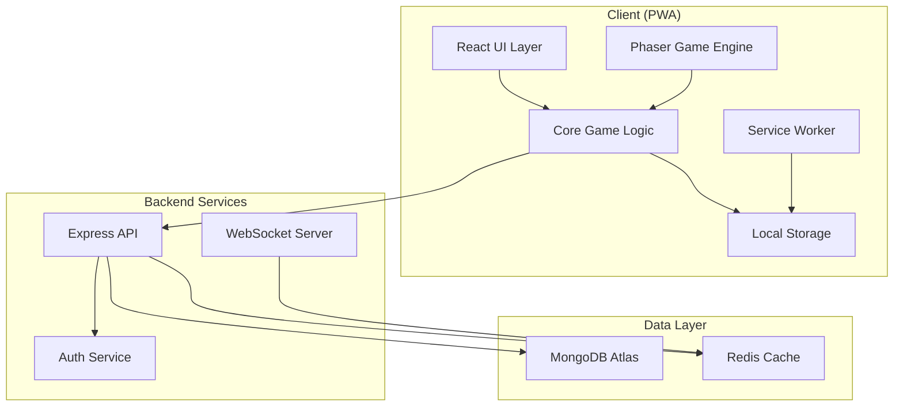

# 🏗️ Llama Wool Farm - Architecture Documentation

## Overview

Llama Wool Farm is built using a modular, scalable architecture that separates game logic, UI, and data layers. This document provides a comprehensive overview of the system architecture.

## Architecture Principles

1. **Separation of Concerns**: Clear boundaries between game logic, rendering, and data
2. **Framework Agnostic Core**: Game logic independent of Phaser.js or React
3. **Offline First**: PWA design with service workers and local storage
4. **Performance Optimized**: 60fps target with efficient rendering
5. **Type Safe**: Full TypeScript coverage with strict mode

## System Architecture



## Core Components

### 1. Game Core (`/src/core/`)
Framework-agnostic game logic:
- **Entities**: Llama, Wool, Upgrade, Building
- **Managers**: ProductionManager, PrestigeManager, SaveManager
- **Systems**: OfflineSystem, AchievementSystem, EventSystem

### 2. Phaser Integration (`/src/game/`, `/src/scenes/`)
- **Scenes**: Boot, Preloader, Main, Prestige
- **Objects**: LlamaSprite, WoolParticle, UIButton
- **Config**: Game configuration and asset management

### 3. React UI Layer (`/src/ui/`)
- **Components**: UpgradePanel, StatsDisplay, Settings
- **Overlays**: Tutorial, Achievements, Shop
- **Hooks**: useGameState, useProduction, useOfflineProgress

### 4. Service Layer (`/src/services/`)
- **API Client**: REST endpoints for saves, leaderboards
- **Auth Service**: JWT-based authentication
- **Analytics**: Event tracking and metrics
- **Storage**: Local and cloud save management

## Design Patterns

### Factory Pattern
```typescript
// Creating game entities
const woolFactory = new WoolFactory();
const quantumWool = woolFactory.create(WoolType.Quantum);
```

### Observer Pattern
```typescript
// Event-driven architecture
eventManager.on('wool.produced', (amount) => {
  achievementSystem.checkWoolMilestone(amount);
  analyticsService.trackEvent('wool_produced', { amount });
});
```

### State Pattern
```typescript
// Game state management
class GameStateMachine {
  states = { menu: MenuState, playing: PlayingState, prestige: PrestigeState };
  transition(newState: GameState) { /* ... */ }
}
```

### Command Pattern
```typescript
// Reversible actions
const upgradeCommand = new UpgradeCommand(building, level);
commandManager.execute(upgradeCommand);
commandManager.undo(); // Revert upgrade
```

## Data Flow

### Production Cycle
1. **Timer Tick** (60fps) → Production calculation
2. **Wool Generation** → Apply multipliers and bonuses
3. **State Update** → Update game state and UI
4. **Auto-Save** → Persist to local storage
5. **Sync** → Background sync to cloud

### User Action Flow
1. **User Input** → UI Component
2. **Action Dispatch** → Game Core
3. **State Mutation** → Apply changes
4. **Side Effects** → Achievements, analytics
5. **UI Update** → React re-render

## Performance Optimization

### Rendering
- Object pooling for particles
- Viewport culling for off-screen objects
- Texture atlases for sprites
- WebGL renderer with fallback

### Game Logic
- Efficient big number arithmetic
- Delta time accumulation
- Batch calculations per second
- Web Workers for heavy computations

### Memory Management
- Automatic garbage collection
- Resource cleanup on scene change
- Compressed save data
- Lazy loading of assets

## Security Considerations

1. **Client Validation**: Input sanitization and bounds checking
2. **Server Validation**: Authoritative game state validation
3. **Anti-Cheat**: Timestamp validation, progression analysis
4. **Data Encryption**: Sensitive data encrypted in transit
5. **Rate Limiting**: API request throttling

## Scalability

### Horizontal Scaling
- Stateless API servers
- Redis for session management
- MongoDB sharding for user data
- CDN for static assets

### Feature Scaling
- Modular system design
- Plugin architecture for new features
- Feature flags for gradual rollout
- A/B testing framework

## Monitoring & Analytics

### Performance Metrics
- FPS and frame time
- Memory usage
- Network latency
- Error rates

### Game Metrics
- Player progression
- Retention rates
- Monetization metrics
- Feature usage

### Technical Monitoring
- Server health
- Database performance
- API response times
- Error tracking (Sentry)

## Development Workflow

1. **Local Development**: Hot reload with Webpack Dev Server
2. **Testing**: Unit, integration, and E2E tests
3. **CI/CD**: Automated testing and deployment
4. **Staging**: Preview environment for testing
5. **Production**: Blue-green deployment with rollback

## Future Considerations

- **Multiplayer**: Real-time leaderboards and competitions
- **Mod Support**: User-generated content framework
- **Cross-Platform**: Native mobile apps via Capacitor
- **Advanced Features**: Guilds, events, seasonal content