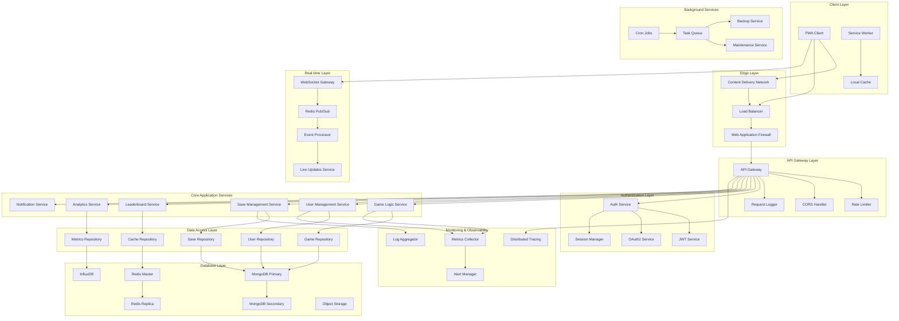
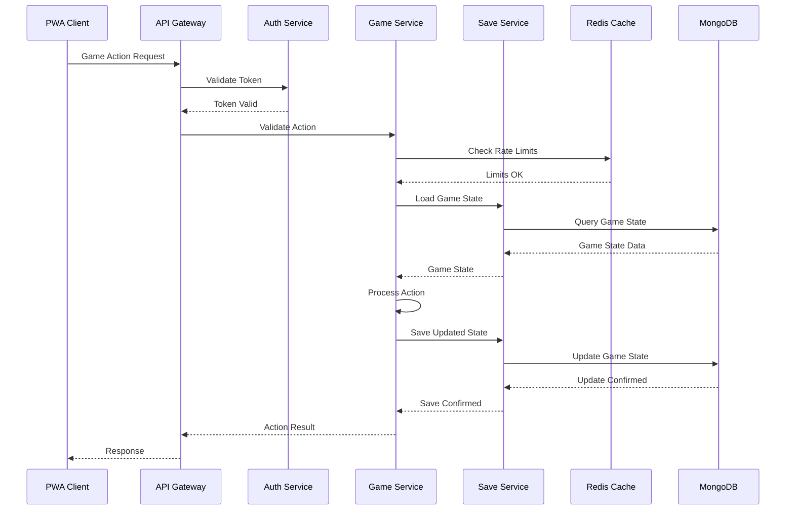
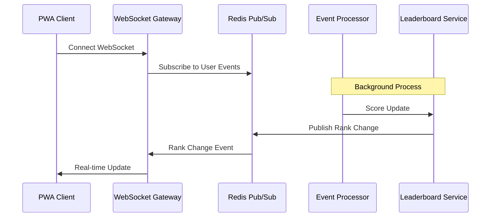

# 🏗️ Backend Services Architecture

## 🎯 Service Architecture Overview

This document details the backend services architecture for Llama Wool Farm, providing comprehensive service definitions, interaction patterns, and implementation strategies.

## 🌐 Service Topology



## 🔧 Service Definitions

### 1. Game Logic Service

**Responsibilities:**
- Validate game actions and state changes
- Calculate production rates and offline progress
- Handle prestige and upgrade logic
- Implement anti-cheat measures

**Key Interfaces:**
```typescript
interface GameLogicService {
  // Action validation
  validateAction(userId: string, action: GameAction): Promise<ValidationResult>;
  
  // Production calculations
  calculateProduction(gameState: GameState): Promise<ProductionResult>;
  calculateOfflineProgress(gameState: GameState, offlineTime: number): Promise<OfflineProgressResult>;
  
  // Prestige system
  calculatePrestigeRewards(gameState: GameState): Promise<PrestigeReward[]>;
  executePrestige(userId: string, gameState: GameState): Promise<PrestigeResult>;
  
  // Upgrade system
  validateUpgrade(gameState: GameState, upgrade: UpgradeRequest): Promise<UpgradeValidation>;
  applyUpgrade(gameState: GameState, upgrade: UpgradeRequest): Promise<GameState>;
  
  // Anti-cheat
  detectAnomalies(userId: string, gameState: GameState): Promise<AnomalyReport>;
  validateProgression(userId: string, previousState: GameState, currentState: GameState): Promise<ValidationResult>;
}
```

**Service Implementation:**
```typescript
@Injectable()
export class GameLogicService {
  constructor(
    private gameRepository: GameRepository,
    private antiCheatService: AntiCheatService,
    private productionCalculator: ProductionCalculator
  ) {}

  async validateAction(userId: string, action: GameAction): Promise<ValidationResult> {
    // Load current game state
    const gameState = await this.gameRepository.findGameState(userId);
    
    // Validate action against current state
    const isValid = await this.validateActionAgainstState(action, gameState);
    
    if (!isValid) {
      return { valid: false, reason: 'Invalid action for current state' };
    }
    
    // Check for suspicious patterns
    const anomalies = await this.antiCheatService.detectAnomalies(userId, action);
    
    if (anomalies.length > 0) {
      return { valid: false, reason: 'Suspicious activity detected', anomalies };
    }
    
    return { valid: true };
  }

  async calculateProduction(gameState: GameState): Promise<ProductionResult> {
    const baseProduction = await this.productionCalculator.calculateBase(gameState);
    const multipliers = await this.productionCalculator.calculateMultipliers(gameState);
    const bonuses = await this.productionCalculator.calculateBonuses(gameState);
    
    return {
      baseProduction,
      totalMultiplier: multipliers.reduce((a, b) => a * b, 1),
      totalBonus: bonuses.reduce((a, b) => a + b, 0),
      finalProduction: baseProduction * multipliers.reduce((a, b) => a * b, 1) + bonuses.reduce((a, b) => a + b, 0)
    };
  }
}
```

### 2. User Management Service

**Responsibilities:**
- User registration and authentication
- Profile management and preferences
- Social features and friend systems
- Account security and privacy

**Key Interfaces:**
```typescript
interface UserManagementService {
  // Authentication
  register(userData: UserRegistrationData): Promise<UserRegistrationResult>;
  login(credentials: UserCredentials): Promise<LoginResult>;
  logout(userId: string): Promise<void>;
  refreshToken(refreshToken: string): Promise<TokenResult>;
  
  // Profile management
  getProfile(userId: string): Promise<UserProfile>;
  updateProfile(userId: string, updates: Partial<UserProfile>): Promise<UserProfile>;
  deleteAccount(userId: string): Promise<void>;
  
  // Social features
  addFriend(userId: string, friendId: string): Promise<FriendshipResult>;
  getFriends(userId: string): Promise<UserProfile[]>;
  getLeaderboardPosition(userId: string): Promise<LeaderboardPosition>;
  
  // Security
  changePassword(userId: string, oldPassword: string, newPassword: string): Promise<void>;
  enable2FA(userId: string): Promise<TwoFactorSetup>;
  verify2FA(userId: string, token: string): Promise<boolean>;
}
```

### 3. Save Management Service

**Responsibilities:**
- Game state persistence and retrieval
- Save conflict resolution
- Backup and restore functionality
- Save file integrity validation

**Key Interfaces:**
```typescript
interface SaveManagementService {
  // Save operations
  saveGameState(userId: string, gameState: GameState): Promise<SaveResult>;
  loadGameState(userId: string): Promise<GameState>;
  
  // Conflict resolution
  resolveSaveConflict(userId: string, localState: GameState, serverState: GameState): Promise<GameState>;
  
  // Backup operations
  createBackup(userId: string): Promise<BackupResult>;
  restoreBackup(userId: string, backupId: string): Promise<GameState>;
  listBackups(userId: string): Promise<BackupInfo[]>;
  
  // Migration
  migrateGameState(userId: string, fromVersion: string, toVersion: string): Promise<MigrationResult>;
}
```

### 4. Leaderboard Service

**Responsibilities:**
- Global and friend leaderboards
- Achievement tracking
- Competition events
- Ranking calculations

**Key Interfaces:**
```typescript
interface LeaderboardService {
  // Score management
  updateScore(userId: string, scoreType: ScoreType, value: number): Promise<void>;
  getUserScore(userId: string, scoreType: ScoreType): Promise<Score>;
  
  // Leaderboard queries
  getGlobalLeaderboard(scoreType: ScoreType, limit: number): Promise<LeaderboardEntry[]>;
  getFriendsLeaderboard(userId: string, scoreType: ScoreType): Promise<LeaderboardEntry[]>;
  getUserRank(userId: string, scoreType: ScoreType): Promise<RankInfo>;
  
  // Achievements
  checkAchievements(userId: string, gameState: GameState): Promise<Achievement[]>;
  unlockAchievement(userId: string, achievementId: string): Promise<void>;
  
  // Events
  createEvent(event: CompetitionEvent): Promise<EventResult>;
  getActiveEvents(): Promise<CompetitionEvent[]>;
  getEventLeaderboard(eventId: string): Promise<LeaderboardEntry[]>;
}
```

### 5. Analytics Service

**Responsibilities:**
- Player behavior tracking
- Game metrics collection
- Performance monitoring
- Business intelligence

**Key Interfaces:**
```typescript
interface AnalyticsService {
  // Event tracking
  trackEvent(userId: string, event: GameEvent): Promise<void>;
  trackBatch(events: GameEvent[]): Promise<void>;
  
  // Metrics collection
  collectMetrics(userId: string, metrics: GameMetrics): Promise<void>;
  getUserMetrics(userId: string, timeRange: TimeRange): Promise<UserMetrics>;
  
  // Reports
  generateReport(reportType: ReportType, params: ReportParams): Promise<Report>;
  getAggregatedMetrics(metricType: MetricType, timeRange: TimeRange): Promise<AggregatedMetrics>;
  
  // A/B Testing
  assignUserToExperiment(userId: string, experimentId: string): Promise<ExperimentGroup>;
  trackExperimentEvent(userId: string, experimentId: string, event: ExperimentEvent): Promise<void>;
}
```

## 🔄 Service Interaction Patterns

### 1. Request Flow Pattern



### 2. Real-time Update Pattern



### 3. Error Handling Pattern

```typescript
// Centralized Error Handling
export class ServiceErrorHandler {
  static handleServiceError(error: Error, context: ServiceContext): ServiceError {
    if (error instanceof ValidationError) {
      return new ServiceError(400, 'VALIDATION_ERROR', error.message);
    }
    
    if (error instanceof DatabaseError) {
      return new ServiceError(500, 'DATABASE_ERROR', 'Internal server error');
    }
    
    if (error instanceof AuthenticationError) {
      return new ServiceError(401, 'AUTHENTICATION_ERROR', 'Invalid credentials');
    }
    
    if (error instanceof RateLimitError) {
      return new ServiceError(429, 'RATE_LIMIT_ERROR', 'Too many requests');
    }
    
    // Log unknown errors
    logger.error('Unknown service error', { error, context });
    return new ServiceError(500, 'INTERNAL_ERROR', 'Internal server error');
  }
}
```

## 📊 Service Communication Protocols

### 1. REST API Communication

```typescript
// REST API Standards
interface RESTAPIStandards {
  // HTTP Methods
  GET: 'Read operations';
  POST: 'Create operations';
  PUT: 'Update operations (full replacement)';
  PATCH: 'Partial update operations';
  DELETE: 'Delete operations';
  
  // Status Codes
  200: 'Success';
  201: 'Created';
  204: 'No Content';
  400: 'Bad Request';
  401: 'Unauthorized';
  403: 'Forbidden';
  404: 'Not Found';
  409: 'Conflict';
  422: 'Validation Error';
  429: 'Rate Limited';
  500: 'Internal Server Error';
  502: 'Bad Gateway';
  503: 'Service Unavailable';
}

// Standard Response Format
interface APIResponse<T> {
  success: boolean;
  data?: T;
  error?: {
    code: string;
    message: string;
    details?: any;
  };
  meta?: {
    timestamp: string;
    requestId: string;
    pagination?: PaginationMeta;
  };
}
```

### 2. WebSocket Communication

```typescript
// WebSocket Message Protocol
interface WebSocketMessage {
  type: 'event' | 'command' | 'response' | 'error';
  id: string;
  timestamp: number;
  data: any;
}

// WebSocket Events
enum WebSocketEvents {
  // Game Events
  GAME_STATE_UPDATE = 'game:state:update',
  PRODUCTION_TICK = 'game:production:tick',
  PRESTIGE_COMPLETE = 'game:prestige:complete',
  
  // Social Events
  FRIEND_ONLINE = 'social:friend:online',
  FRIEND_OFFLINE = 'social:friend:offline',
  LEADERBOARD_UPDATE = 'social:leaderboard:update',
  
  // System Events
  MAINTENANCE_MODE = 'system:maintenance:mode',
  SERVER_RESTART = 'system:server:restart',
  FEATURE_TOGGLE = 'system:feature:toggle'
}
```

### 3. Service-to-Service Communication

```typescript
// Internal Service Communication
interface ServiceClient {
  async call<T>(
    service: string,
    method: string,
    params: any,
    options?: {
      timeout?: number;
      retries?: number;
      circuit?: boolean;
    }
  ): Promise<T>;
}

// Circuit Breaker Pattern
class CircuitBreaker {
  private state: 'closed' | 'open' | 'half-open' = 'closed';
  private failureCount = 0;
  private successCount = 0;
  private lastFailureTime = 0;
  
  async execute<T>(operation: () => Promise<T>): Promise<T> {
    if (this.state === 'open') {
      if (Date.now() - this.lastFailureTime > this.timeout) {
        this.state = 'half-open';
      } else {
        throw new Error('Circuit breaker is open');
      }
    }
    
    try {
      const result = await operation();
      this.onSuccess();
      return result;
    } catch (error) {
      this.onFailure();
      throw error;
    }
  }
  
  private onSuccess(): void {
    this.failureCount = 0;
    if (this.state === 'half-open') {
      this.state = 'closed';
    }
  }
  
  private onFailure(): void {
    this.failureCount++;
    this.lastFailureTime = Date.now();
    
    if (this.failureCount >= this.threshold) {
      this.state = 'open';
    }
  }
}
```

## 🛡️ Security Patterns

### 1. Authentication & Authorization

```typescript
// JWT Token Management
interface JWTTokenManager {
  generateAccessToken(user: User): Promise<string>;
  generateRefreshToken(user: User): Promise<string>;
  validateToken(token: string): Promise<TokenValidation>;
  refreshAccessToken(refreshToken: string): Promise<TokenPair>;
  revokeToken(token: string): Promise<void>;
}

// Role-Based Access Control
interface RBACService {
  hasPermission(userId: string, resource: string, action: string): Promise<boolean>;
  assignRole(userId: string, role: string): Promise<void>;
  revokeRole(userId: string, role: string): Promise<void>;
  getUserRoles(userId: string): Promise<string[]>;
}
```

### 2. Data Validation & Sanitization

```typescript
// Input Validation
class InputValidator {
  static validateGameAction(action: GameAction): ValidationResult {
    const schema = Joi.object({
      type: Joi.string().valid('produce', 'upgrade', 'prestige').required(),
      payload: Joi.object().required(),
      timestamp: Joi.number().integer().min(0).required()
    });
    
    const { error } = schema.validate(action);
    return error ? { valid: false, errors: error.details } : { valid: true };
  }
  
  static sanitizeUserInput(input: string): string {
    return input
      .replace(/[<>]/g, '') // Remove HTML tags
      .replace(/['"]/g, '') // Remove quotes
      .trim()
      .substring(0, 1000); // Limit length
  }
}
```

## 📈 Performance Optimization

### 1. Database Optimization

```typescript
// Database Connection Pooling
interface DatabasePool {
  getConnection(): Promise<DatabaseConnection>;
  releaseConnection(connection: DatabaseConnection): void;
  closeAll(): Promise<void>;
}

// Query Optimization
class QueryOptimizer {
  static async optimizeUserQuery(userId: string): Promise<UserData> {
    // Use projection to limit fields
    return await db.collection('users').findOne(
      { userId },
      { projection: { password: 0, internalNotes: 0 } }
    );
  }
  
  static async batchUpdateScores(updates: ScoreUpdate[]): Promise<void> {
    // Use bulk operations for efficiency
    const bulkOps = updates.map(update => ({
      updateOne: {
        filter: { userId: update.userId },
        update: { $inc: { score: update.delta } },
        upsert: true
      }
    }));
    
    await db.collection('scores').bulkWrite(bulkOps);
  }
}
```

### 2. Caching Strategies

```typescript
// Multi-level Cache
class CacheManager {
  private l1Cache: Map<string, CacheEntry> = new Map();
  private l2Cache: RedisClient;
  private l3Cache: DatabaseClient;
  
  async get<T>(key: string): Promise<T | null> {
    // L1 Cache (Memory)
    if (this.l1Cache.has(key)) {
      const entry = this.l1Cache.get(key);
      if (entry && entry.expiresAt > Date.now()) {
        return entry.data as T;
      }
      this.l1Cache.delete(key);
    }
    
    // L2 Cache (Redis)
    const l2Data = await this.l2Cache.get(key);
    if (l2Data) {
      const data = JSON.parse(l2Data);
      this.l1Cache.set(key, { data, expiresAt: Date.now() + 60000 });
      return data as T;
    }
    
    // L3 Cache (Database)
    const l3Data = await this.l3Cache.get(key);
    if (l3Data) {
      await this.l2Cache.setex(key, 3600, JSON.stringify(l3Data));
      this.l1Cache.set(key, { data: l3Data, expiresAt: Date.now() + 60000 });
      return l3Data as T;
    }
    
    return null;
  }
}
```

## 🔍 Monitoring & Observability

### 1. Metrics Collection

```typescript
// Metrics Collection
class MetricsCollector {
  private registry: PrometheusRegistry;
  
  // Service metrics
  requestCounter = new Counter({
    name: 'http_requests_total',
    help: 'Total HTTP requests',
    labelNames: ['method', 'route', 'status']
  });
  
  requestDuration = new Histogram({
    name: 'http_request_duration_seconds',
    help: 'HTTP request duration',
    labelNames: ['method', 'route']
  });
  
  // Business metrics
  userRegistrations = new Counter({
    name: 'user_registrations_total',
    help: 'Total user registrations'
  });
  
  gameActions = new Counter({
    name: 'game_actions_total',
    help: 'Total game actions',
    labelNames: ['action_type']
  });
}
```

### 2. Distributed Tracing

```typescript
// Distributed Tracing
class TracingService {
  createSpan(operationName: string, parentSpan?: Span): Span {
    const span = tracer.startSpan(operationName, {
      childOf: parentSpan
    });
    
    return span;
  }
  
  async traceServiceCall<T>(
    operationName: string,
    service: string,
    operation: () => Promise<T>,
    parentSpan?: Span
  ): Promise<T> {
    const span = this.createSpan(operationName, parentSpan);
    span.setTag('service', service);
    
    try {
      const result = await operation();
      span.setTag('success', true);
      return result;
    } catch (error) {
      span.setTag('success', false);
      span.setTag('error', error.message);
      throw error;
    } finally {
      span.finish();
    }
  }
}
```

---

This backend services architecture provides a comprehensive foundation for building a scalable, maintainable, and secure backend system for Llama Wool Farm. The modular design allows for independent development, testing, and deployment of services while maintaining clear boundaries and communication patterns.