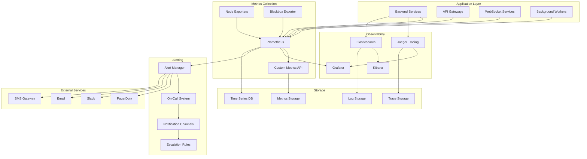

# 🔍 Monitoring & Alerting Strategy

## 🎯 Overview

This document outlines the comprehensive monitoring and alerting strategy for Llama Wool Farm's backend infrastructure, covering metrics collection, observability, alerting, and incident response procedures.

## 📊 Monitoring Architecture



## 🔧 Metrics Collection

### Application Metrics

```typescript
// Metrics Collection Service
import { register, Counter, Histogram, Gauge } from 'prom-client';

export class MetricsService {
  // HTTP Request metrics
  private requestCounter = new Counter({
    name: 'http_requests_total',
    help: 'Total number of HTTP requests',
    labelNames: ['method', 'route', 'status_code', 'service'],
    registers: [register]
  });

  private requestDuration = new Histogram({
    name: 'http_request_duration_seconds',
    help: 'Duration of HTTP requests in seconds',
    labelNames: ['method', 'route', 'service'],
    buckets: [0.1, 0.5, 1, 2, 5, 10],
    registers: [register]
  });

  // Database metrics
  private dbQueryCounter = new Counter({
    name: 'database_queries_total',
    help: 'Total number of database queries',
    labelNames: ['operation', 'collection', 'status'],
    registers: [register]
  });

  private dbQueryDuration = new Histogram({
    name: 'database_query_duration_seconds',
    help: 'Duration of database queries in seconds',
    labelNames: ['operation', 'collection'],
    buckets: [0.01, 0.05, 0.1, 0.5, 1, 2],
    registers: [register]
  });

  private dbConnectionsGauge = new Gauge({
    name: 'database_connections_active',
    help: 'Number of active database connections',
    labelNames: ['database'],
    registers: [register]
  });

  // Cache metrics
  private cacheHitCounter = new Counter({
    name: 'cache_hits_total',
    help: 'Total number of cache hits',
    labelNames: ['cache_type', 'key_pattern'],
    registers: [register]
  });

  private cacheMissCounter = new Counter({
    name: 'cache_misses_total',
    help: 'Total number of cache misses',
    labelNames: ['cache_type', 'key_pattern'],
    registers: [register]
  });

  // Game-specific metrics
  private activeUsersGauge = new Gauge({
    name: 'active_users_current',
    help: 'Current number of active users',
    registers: [register]
  });

  private gameActionsCounter = new Counter({
    name: 'game_actions_total',
    help: 'Total number of game actions',
    labelNames: ['action_type', 'user_tier'],
    registers: [register]
  });

  private woolProductionRate = new Gauge({
    name: 'wool_production_rate_per_second',
    help: 'Current wool production rate per second',
    labelNames: ['wool_type'],
    registers: [register]
  });

  private prestigeCounter = new Counter({
    name: 'prestige_events_total',
    help: 'Total number of prestige events',
    labelNames: ['prestige_level'],
    registers: [register]
  });

  // WebSocket metrics
  private wsConnectionsGauge = new Gauge({
    name: 'websocket_connections_active',
    help: 'Number of active WebSocket connections',
    registers: [register]
  });

  private wsMessagesCounter = new Counter({
    name: 'websocket_messages_total',
    help: 'Total number of WebSocket messages',
    labelNames: ['direction', 'message_type'],
    registers: [register]
  });

  // Error metrics
  private errorCounter = new Counter({
    name: 'errors_total',
    help: 'Total number of errors',
    labelNames: ['service', 'error_type', 'severity'],
    registers: [register]
  });

  // Business metrics
  private userRegistrationCounter = new Counter({
    name: 'user_registrations_total',
    help: 'Total number of user registrations',
    labelNames: ['source', 'country'],
    registers: [register]
  });

  private revenueGauge = new Gauge({
    name: 'revenue_current',
    help: 'Current revenue metrics',
    labelNames: ['currency', 'source'],
    registers: [register]
  });

  // Methods to record metrics
  recordRequest(method: string, route: string, statusCode: number, service: string, duration: number): void {
    this.requestCounter.inc({ method, route, status_code: statusCode, service });
    this.requestDuration.observe({ method, route, service }, duration);
  }

  recordDatabaseQuery(operation: string, collection: string, status: string, duration: number): void {
    this.dbQueryCounter.inc({ operation, collection, status });
    this.dbQueryDuration.observe({ operation, collection }, duration);
  }

  recordCacheAccess(type: string, keyPattern: string, hit: boolean): void {
    if (hit) {
      this.cacheHitCounter.inc({ cache_type: type, key_pattern: keyPattern });
    } else {
      this.cacheMissCounter.inc({ cache_type: type, key_pattern: keyPattern });
    }
  }

  recordGameAction(actionType: string, userTier: string): void {
    this.gameActionsCounter.inc({ action_type: actionType, user_tier: userTier });
  }

  updateActiveUsers(count: number): void {
    this.activeUsersGauge.set(count);
  }

  updateWoolProduction(woolType: string, rate: number): void {
    this.woolProductionRate.set({ wool_type: woolType }, rate);
  }

  recordPrestige(level: number): void {
    this.prestigeCounter.inc({ prestige_level: level.toString() });
  }

  updateWebSocketConnections(count: number): void {
    this.wsConnectionsGauge.set(count);
  }

  recordWebSocketMessage(direction: 'in' | 'out', messageType: string): void {
    this.wsMessagesCounter.inc({ direction, message_type: messageType });
  }

  recordError(service: string, errorType: string, severity: string): void {
    this.errorCounter.inc({ service, error_type: errorType, severity });
  }

  recordUserRegistration(source: string, country: string): void {
    this.userRegistrationCounter.inc({ source, country });
  }

  updateRevenue(currency: string, source: string, amount: number): void {
    this.revenueGauge.set({ currency, source }, amount);
  }

  // Get metrics for Prometheus endpoint
  getMetrics(): Promise<string> {
    return register.metrics();
  }
}
```

### Custom Metrics Middleware

```typescript
// Express Middleware for Automatic Metrics Collection
import { Request, Response, NextFunction } from 'express';
import { MetricsService } from './metrics.service';

export class MetricsMiddleware {
  constructor(private metricsService: MetricsService) {}

  // HTTP Request Metrics Middleware
  requestMetrics() {
    return (req: Request, res: Response, next: NextFunction) => {
      const startTime = Date.now();
      
      res.on('finish', () => {
        const duration = (Date.now() - startTime) / 1000;
        const route = req.route?.path || req.path;
        
        this.metricsService.recordRequest(
          req.method,
          route,
          res.statusCode,
          process.env.SERVICE_NAME || 'unknown',
          duration
        );
      });
      
      next();
    };
  }

  // Database Query Metrics Decorator
  databaseMetrics() {
    return (target: any, propertyKey: string, descriptor: PropertyDescriptor) => {
      const originalMethod = descriptor.value;
      
      descriptor.value = async function(...args: any[]) {
        const startTime = Date.now();
        const operation = propertyKey;
        const collection = args[0]?.constructor?.name || 'unknown';
        
        try {
          const result = await originalMethod.apply(this, args);
          const duration = (Date.now() - startTime) / 1000;
          
          this.metricsService.recordDatabaseQuery(operation, collection, 'success', duration);
          return result;
        } catch (error) {
          const duration = (Date.now() - startTime) / 1000;
          this.metricsService.recordDatabaseQuery(operation, collection, 'error', duration);
          throw error;
        }
      };
      
      return descriptor;
    };
  }

  // Cache Metrics Decorator
  cacheMetrics() {
    return (target: any, propertyKey: string, descriptor: PropertyDescriptor) => {
      const originalMethod = descriptor.value;
      
      descriptor.value = async function(...args: any[]) {
        const key = args[0];
        const keyPattern = this.getKeyPattern(key);
        
        try {
          const result = await originalMethod.apply(this, args);
          const hit = result !== null && result !== undefined;
          
          this.metricsService.recordCacheAccess('redis', keyPattern, hit);
          return result;
        } catch (error) {
          this.metricsService.recordCacheAccess('redis', keyPattern, false);
          throw error;
        }
      };
      
      return descriptor;
    };
  }

  private getKeyPattern(key: string): string {
    // Convert specific keys to patterns
    // e.g., "user:12345:profile" -> "user:*:profile"
    return key.replace(/:\d+/g, ':*').replace(/:[a-f0-9-]{36}/g, ':*');
  }
}
```

### Health Check System

```typescript
// Health Check Service
export interface HealthCheck {
  name: string;
  execute(): Promise<HealthCheckResult>;
}

export interface HealthCheckResult {
  status: 'healthy' | 'unhealthy' | 'degraded';
  responseTime: number;
  message?: string;
  details?: any;
}

export class HealthCheckService {
  private checks: HealthCheck[] = [];
  
  registerCheck(check: HealthCheck): void {
    this.checks.push(check);
  }
  
  async checkHealth(): Promise<HealthReport> {
    const results = await Promise.allSettled(
      this.checks.map(async check => {
        const startTime = Date.now();
        try {
          const result = await Promise.race([
            check.execute(),
            this.timeout(5000) // 5 second timeout
          ]);
          return {
            name: check.name,
            ...result,
            responseTime: Date.now() - startTime
          };
        } catch (error) {
          return {
            name: check.name,
            status: 'unhealthy' as const,
            responseTime: Date.now() - startTime,
            message: error.message
          };
        }
      })
    );
    
    const healthChecks = results.map(result => 
      result.status === 'fulfilled' ? result.value : {
        name: 'unknown',
        status: 'unhealthy' as const,
        responseTime: 0,
        message: 'Health check failed'
      }
    );
    
    const overallStatus = this.calculateOverallStatus(healthChecks);
    
    return {
      status: overallStatus,
      timestamp: new Date(),
      checks: healthChecks,
      uptime: process.uptime(),
      version: process.env.APP_VERSION || 'unknown'
    };
  }
  
  private calculateOverallStatus(checks: HealthCheckResult[]): 'healthy' | 'unhealthy' | 'degraded' {
    const unhealthyCount = checks.filter(c => c.status === 'unhealthy').length;
    const degradedCount = checks.filter(c => c.status === 'degraded').length;
    
    if (unhealthyCount > 0) {
      return 'unhealthy';
    } else if (degradedCount > 0) {
      return 'degraded';
    } else {
      return 'healthy';
    }
  }
  
  private timeout(ms: number): Promise<never> {
    return new Promise((_, reject) => {
      setTimeout(() => reject(new Error('Health check timeout')), ms);
    });
  }
}

// Database Health Check
export class DatabaseHealthCheck implements HealthCheck {
  name = 'database';
  
  constructor(private dbClient: any) {}
  
  async execute(): Promise<HealthCheckResult> {
    try {
      const startTime = Date.now();
      await this.dbClient.admin().ping();
      const responseTime = Date.now() - startTime;
      
      if (responseTime > 1000) {
        return {
          status: 'degraded',
          responseTime,
          message: 'Database response time is slow'
        };
      }
      
      return {
        status: 'healthy',
        responseTime
      };
    } catch (error) {
      return {
        status: 'unhealthy',
        responseTime: 0,
        message: `Database connection failed: ${error.message}`
      };
    }
  }
}

// Redis Health Check
export class RedisHealthCheck implements HealthCheck {
  name = 'redis';
  
  constructor(private redisClient: any) {}
  
  async execute(): Promise<HealthCheckResult> {
    try {
      const startTime = Date.now();
      await this.redisClient.ping();
      const responseTime = Date.now() - startTime;
      
      return {
        status: 'healthy',
        responseTime
      };
    } catch (error) {
      return {
        status: 'unhealthy',
        responseTime: 0,
        message: `Redis connection failed: ${error.message}`
      };
    }
  }
}

// External API Health Check
export class ExternalAPIHealthCheck implements HealthCheck {
  name = 'external-api';
  
  constructor(private apiUrl: string) {}
  
  async execute(): Promise<HealthCheckResult> {
    try {
      const startTime = Date.now();
      const response = await fetch(`${this.apiUrl}/health`);
      const responseTime = Date.now() - startTime;
      
      if (!response.ok) {
        return {
          status: 'unhealthy',
          responseTime,
          message: `API returned ${response.status}`
        };
      }
      
      return {
        status: 'healthy',
        responseTime
      };
    } catch (error) {
      return {
        status: 'unhealthy',
        responseTime: 0,
        message: `API request failed: ${error.message}`
      };
    }
  }
}
```

## 🚨 Alerting Configuration

### Alert Rules

```yaml
# Prometheus Alert Rules
groups:
- name: llamawool.infrastructure
  rules:
  - alert: HighErrorRate
    expr: (rate(http_requests_total{status_code=~"5.."}[5m]) / rate(http_requests_total[5m])) > 0.05
    for: 5m
    labels:
      severity: critical
      team: backend
    annotations:
      summary: "High error rate detected"
      description: "Service {{ $labels.service }} has error rate of {{ $value | humanizePercentage }} for the last 5 minutes"
      runbook_url: "https://runbook.llamawool.com/high-error-rate"

  - alert: HighResponseTime
    expr: histogram_quantile(0.95, rate(http_request_duration_seconds_bucket[5m])) > 2
    for: 5m
    labels:
      severity: warning
      team: backend
    annotations:
      summary: "High response time detected"
      description: "Service {{ $labels.service }} has 95th percentile response time of {{ $value }}s"
      runbook_url: "https://runbook.llamawool.com/high-response-time"

  - alert: DatabaseConnectionsHigh
    expr: database_connections_active > 80
    for: 2m
    labels:
      severity: warning
      team: database
    annotations:
      summary: "High database connections"
      description: "Database {{ $labels.database }} has {{ $value }} active connections"

  - alert: DatabaseConnectionsDown
    expr: database_connections_active < 1
    for: 1m
    labels:
      severity: critical
      team: database
    annotations:
      summary: "Database connections down"
      description: "Database {{ $labels.database }} has no active connections"

  - alert: RedisConnectionsFailed
    expr: increase(redis_commands_failed_total[5m]) > 10
    for: 2m
    labels:
      severity: warning
      team: cache
    annotations:
      summary: "Redis connection failures"
      description: "Redis has {{ $value }} failed commands in the last 5 minutes"

  - alert: DiskSpaceHigh
    expr: (node_filesystem_avail_bytes / node_filesystem_size_bytes) < 0.1
    for: 5m
    labels:
      severity: warning
      team: infrastructure
    annotations:
      summary: "Disk space running low"
      description: "Disk space on {{ $labels.instance }} is {{ $value | humanizePercentage }} full"

  - alert: MemoryUsageHigh
    expr: (node_memory_MemTotal_bytes - node_memory_MemAvailable_bytes) / node_memory_MemTotal_bytes > 0.9
    for: 5m
    labels:
      severity: critical
      team: infrastructure
    annotations:
      summary: "High memory usage"
      description: "Memory usage on {{ $labels.instance }} is {{ $value | humanizePercentage }}"

  - alert: CPUUsageHigh
    expr: 100 - (avg(rate(node_cpu_seconds_total{mode="idle"}[5m])) * 100) > 80
    for: 10m
    labels:
      severity: warning
      team: infrastructure
    annotations:
      summary: "High CPU usage"
      description: "CPU usage on {{ $labels.instance }} is {{ $value | humanizePercentage }}"

- name: llamawool.application
  rules:
  - alert: ActiveUsersDropped
    expr: active_users_current < 100
    for: 15m
    labels:
      severity: warning
      team: product
    annotations:
      summary: "Active users dropped significantly"
      description: "Active users count is {{ $value }}, which is below expected threshold"

  - alert: GameActionsStalled
    expr: rate(game_actions_total[10m]) < 0.1
    for: 10m
    labels:
      severity: warning
      team: game
    annotations:
      summary: "Game actions stalled"
      description: "Game actions per second is {{ $value }}, which is unusually low"

  - alert: WebSocketConnectionsHigh
    expr: websocket_connections_active > 10000
    for: 5m
    labels:
      severity: warning
      team: backend
    annotations:
      summary: "High WebSocket connections"
      description: "WebSocket connections are {{ $value }}, approaching limits"

  - alert: PrestigeRateUnusual
    expr: rate(prestige_events_total[1h]) > 1000
    for: 15m
    labels:
      severity: warning
      team: game
    annotations:
      summary: "Unusual prestige rate"
      description: "Prestige rate is {{ $value }} per hour, which may indicate cheating"

  - alert: ErrorRateSpike
    expr: increase(errors_total[5m]) > 100
    for: 2m
    labels:
      severity: critical
      team: backend
    annotations:
      summary: "Error rate spike"
      description: "{{ $value }} errors in the last 5 minutes"

- name: llamawool.business
  rules:
  - alert: UserRegistrationDropped
    expr: rate(user_registrations_total[1h]) < 1
    for: 30m
    labels:
      severity: warning
      team: marketing
    annotations:
      summary: "User registrations dropped"
      description: "User registration rate is {{ $value }} per hour"

  - alert: RevenueDropped
    expr: (revenue_current - revenue_current offset 1h) / revenue_current offset 1h < -0.5
    for: 30m
    labels:
      severity: critical
      team: business
    annotations:
      summary: "Revenue dropped significantly"
      description: "Revenue dropped by {{ $value | humanizePercentage }} in the last hour"
```

### Alert Manager Configuration

```yaml
# AlertManager Configuration
global:
  smtp_smarthost: 'smtp.gmail.com:587'
  smtp_from: 'alerts@llamawool.com'
  smtp_auth_username: 'alerts@llamawool.com'
  smtp_auth_password: 'app-password'

route:
  group_by: ['alertname', 'cluster', 'service']
  group_wait: 10s
  group_interval: 30s
  repeat_interval: 12h
  receiver: 'default'
  routes:
  - match:
      severity: critical
    receiver: 'critical-alerts'
    continue: true
  - match:
      team: database
    receiver: 'database-team'
  - match:
      team: backend
    receiver: 'backend-team'
  - match:
      team: infrastructure
    receiver: 'infrastructure-team'
  - match:
      team: game
    receiver: 'game-team'
  - match:
      team: business
    receiver: 'business-team'

receivers:
- name: 'default'
  slack_configs:
  - api_url: 'https://hooks.slack.com/services/YOUR/SLACK/WEBHOOK'
    channel: '#alerts'
    title: 'Llama Wool Farm Alert'
    text: '{{ range .Alerts }}{{ .Annotations.summary }}{{ end }}'

- name: 'critical-alerts'
  pagerduty_configs:
  - routing_key: 'YOUR_PAGERDUTY_ROUTING_KEY'
    description: '{{ range .Alerts }}{{ .Annotations.summary }}{{ end }}'
    severity: 'critical'
  slack_configs:
  - api_url: 'https://hooks.slack.com/services/YOUR/SLACK/WEBHOOK'
    channel: '#critical-alerts'
    title: '🚨 CRITICAL ALERT'
    text: '{{ range .Alerts }}{{ .Annotations.summary }}{{ end }}'
    color: 'danger'

- name: 'database-team'
  slack_configs:
  - api_url: 'https://hooks.slack.com/services/YOUR/SLACK/WEBHOOK'
    channel: '#database-alerts'
    title: 'Database Alert'
    text: '{{ range .Alerts }}{{ .Annotations.summary }}{{ end }}'

- name: 'backend-team'
  slack_configs:
  - api_url: 'https://hooks.slack.com/services/YOUR/SLACK/WEBHOOK'
    channel: '#backend-alerts'
    title: 'Backend Alert'
    text: '{{ range .Alerts }}{{ .Annotations.summary }}{{ end }}'

- name: 'infrastructure-team'
  slack_configs:
  - api_url: 'https://hooks.slack.com/services/YOUR/SLACK/WEBHOOK'
    channel: '#infrastructure-alerts'
    title: 'Infrastructure Alert'
    text: '{{ range .Alerts }}{{ .Annotations.summary }}{{ end }}'

- name: 'game-team'
  slack_configs:
  - api_url: 'https://hooks.slack.com/services/YOUR/SLACK/WEBHOOK'
    channel: '#game-alerts'
    title: 'Game Alert'
    text: '{{ range .Alerts }}{{ .Annotations.summary }}{{ end }}'

- name: 'business-team'
  email_configs:
  - to: 'business-team@llamawool.com'
    subject: 'Business Alert: {{ range .Alerts }}{{ .Annotations.summary }}{{ end }}'
    body: |
      {{ range .Alerts }}
      Alert: {{ .Annotations.summary }}
      Description: {{ .Annotations.description }}
      Time: {{ .StartsAt }}
      {{ end }}

inhibit_rules:
- source_match:
    severity: 'critical'
  target_match:
    severity: 'warning'
  equal: ['alertname', 'cluster', 'service']
```

## 📊 Grafana Dashboards

### Service Overview Dashboard

```json
{
  "dashboard": {
    "id": null,
    "title": "Llama Wool Farm - Service Overview",
    "description": "Overview of all backend services",
    "tags": ["llamawool", "overview"],
    "timezone": "UTC",
    "panels": [
      {
        "id": 1,
        "title": "Request Rate",
        "type": "graph",
        "gridPos": {"h": 8, "w": 12, "x": 0, "y": 0},
        "targets": [
          {
            "expr": "sum(rate(http_requests_total[5m])) by (service)",
            "legendFormat": "{{service}}",
            "refId": "A"
          }
        ],
        "yAxes": [
          {
            "label": "Requests/sec",
            "min": 0
          }
        ]
      },
      {
        "id": 2,
        "title": "Response Time (95th percentile)",
        "type": "graph",
        "gridPos": {"h": 8, "w": 12, "x": 12, "y": 0},
        "targets": [
          {
            "expr": "histogram_quantile(0.95, sum(rate(http_request_duration_seconds_bucket[5m])) by (le, service))",
            "legendFormat": "{{service}}",
            "refId": "A"
          }
        ],
        "yAxes": [
          {
            "label": "Seconds",
            "min": 0
          }
        ]
      },
      {
        "id": 3,
        "title": "Error Rate",
        "type": "graph",
        "gridPos": {"h": 8, "w": 12, "x": 0, "y": 8},
        "targets": [
          {
            "expr": "sum(rate(http_requests_total{status_code=~\"5..\"}[5m])) by (service) / sum(rate(http_requests_total[5m])) by (service)",
            "legendFormat": "{{service}}",
            "refId": "A"
          }
        ],
        "yAxes": [
          {
            "label": "Error Rate",
            "min": 0,
            "max": 1
          }
        ]
      },
      {
        "id": 4,
        "title": "Active Users",
        "type": "singlestat",
        "gridPos": {"h": 8, "w": 12, "x": 12, "y": 8},
        "targets": [
          {
            "expr": "active_users_current",
            "refId": "A"
          }
        ],
        "valueName": "current",
        "format": "short"
      },
      {
        "id": 5,
        "title": "Database Connections",
        "type": "graph",
        "gridPos": {"h": 8, "w": 12, "x": 0, "y": 16},
        "targets": [
          {
            "expr": "database_connections_active",
            "legendFormat": "{{database}}",
            "refId": "A"
          }
        ],
        "yAxes": [
          {
            "label": "Connections",
            "min": 0
          }
        ]
      },
      {
        "id": 6,
        "title": "WebSocket Connections",
        "type": "graph",
        "gridPos": {"h": 8, "w": 12, "x": 12, "y": 16},
        "targets": [
          {
            "expr": "websocket_connections_active",
            "legendFormat": "Active Connections",
            "refId": "A"
          }
        ],
        "yAxes": [
          {
            "label": "Connections",
            "min": 0
          }
        ]
      }
    ],
    "refresh": "10s",
    "time": {
      "from": "now-1h",
      "to": "now"
    }
  }
}
```

### Game Metrics Dashboard

```json
{
  "dashboard": {
    "id": null,
    "title": "Llama Wool Farm - Game Metrics",
    "description": "Game-specific metrics and KPIs",
    "tags": ["llamawool", "game"],
    "timezone": "UTC",
    "panels": [
      {
        "id": 1,
        "title": "Game Actions per Second",
        "type": "graph",
        "gridPos": {"h": 8, "w": 12, "x": 0, "y": 0},
        "targets": [
          {
            "expr": "sum(rate(game_actions_total[5m])) by (action_type)",
            "legendFormat": "{{action_type}}",
            "refId": "A"
          }
        ],
        "yAxes": [
          {
            "label": "Actions/sec",
            "min": 0
          }
        ]
      },
      {
        "id": 2,
        "title": "Wool Production Rate",
        "type": "graph",
        "gridPos": {"h": 8, "w": 12, "x": 12, "y": 0},
        "targets": [
          {
            "expr": "wool_production_rate_per_second",
            "legendFormat": "{{wool_type}}",
            "refId": "A"
          }
        ],
        "yAxes": [
          {
            "label": "Wool/sec",
            "min": 0
          }
        ]
      },
      {
        "id": 3,
        "title": "Prestige Events",
        "type": "graph",
        "gridPos": {"h": 8, "w": 12, "x": 0, "y": 8},
        "targets": [
          {
            "expr": "rate(prestige_events_total[1h]) * 3600",
            "legendFormat": "Level {{prestige_level}}",
            "refId": "A"
          }
        ],
        "yAxes": [
          {
            "label": "Events/hour",
            "min": 0
          }
        ]
      },
      {
        "id": 4,
        "title": "User Registration Rate",
        "type": "graph",
        "gridPos": {"h": 8, "w": 12, "x": 12, "y": 8},
        "targets": [
          {
            "expr": "rate(user_registrations_total[1h]) * 3600",
            "legendFormat": "{{source}}",
            "refId": "A"
          }
        ],
        "yAxes": [
          {
            "label": "Registrations/hour",
            "min": 0
          }
        ]
      }
    ],
    "refresh": "30s",
    "time": {
      "from": "now-6h",
      "to": "now"
    }
  }
}
```

### Infrastructure Dashboard

```json
{
  "dashboard": {
    "id": null,
    "title": "Llama Wool Farm - Infrastructure",
    "description": "Infrastructure metrics and resource usage",
    "tags": ["llamawool", "infrastructure"],
    "timezone": "UTC",
    "panels": [
      {
        "id": 1,
        "title": "CPU Usage",
        "type": "graph",
        "gridPos": {"h": 8, "w": 12, "x": 0, "y": 0},
        "targets": [
          {
            "expr": "100 - (avg(rate(node_cpu_seconds_total{mode=\"idle\"}[5m])) by (instance) * 100)",
            "legendFormat": "{{instance}}",
            "refId": "A"
          }
        ],
        "yAxes": [
          {
            "label": "CPU %",
            "min": 0,
            "max": 100
          }
        ]
      },
      {
        "id": 2,
        "title": "Memory Usage",
        "type": "graph",
        "gridPos": {"h": 8, "w": 12, "x": 12, "y": 0},
        "targets": [
          {
            "expr": "(node_memory_MemTotal_bytes - node_memory_MemAvailable_bytes) / node_memory_MemTotal_bytes * 100",
            "legendFormat": "{{instance}}",
            "refId": "A"
          }
        ],
        "yAxes": [
          {
            "label": "Memory %",
            "min": 0,
            "max": 100
          }
        ]
      },
      {
        "id": 3,
        "title": "Disk Usage",
        "type": "graph",
        "gridPos": {"h": 8, "w": 12, "x": 0, "y": 8},
        "targets": [
          {
            "expr": "(node_filesystem_size_bytes - node_filesystem_avail_bytes) / node_filesystem_size_bytes * 100",
            "legendFormat": "{{instance}}:{{mountpoint}}",
            "refId": "A"
          }
        ],
        "yAxes": [
          {
            "label": "Disk %",
            "min": 0,
            "max": 100
          }
        ]
      },
      {
        "id": 4,
        "title": "Network I/O",
        "type": "graph",
        "gridPos": {"h": 8, "w": 12, "x": 12, "y": 8},
        "targets": [
          {
            "expr": "rate(node_network_receive_bytes_total[5m]) * 8",
            "legendFormat": "{{instance}} - RX",
            "refId": "A"
          },
          {
            "expr": "rate(node_network_transmit_bytes_total[5m]) * 8",
            "legendFormat": "{{instance}} - TX",
            "refId": "B"
          }
        ],
        "yAxes": [
          {
            "label": "Bits/sec",
            "min": 0
          }
        ]
      }
    ],
    "refresh": "10s",
    "time": {
      "from": "now-1h",
      "to": "now"
    }
  }
}
```

## 🔍 Distributed Tracing

### Jaeger Configuration

```typescript
// Tracing Service
import { initTracer } from 'jaeger-client';

export class TracingService {
  private tracer: any;

  constructor() {
    this.tracer = initTracer({
      serviceName: process.env.SERVICE_NAME || 'llamawool-service',
      sampler: {
        type: 'probabilistic',
        param: 0.1 // Sample 10% of requests
      },
      reporter: {
        agentHost: process.env.JAEGER_AGENT_HOST || 'localhost',
        agentPort: process.env.JAEGER_AGENT_PORT || 6832
      }
    });
  }

  createSpan(operationName: string, parentSpan?: any): any {
    return this.tracer.startSpan(operationName, {
      childOf: parentSpan
    });
  }

  async traceFunction<T>(
    operationName: string,
    fn: (span: any) => Promise<T>,
    parentSpan?: any
  ): Promise<T> {
    const span = this.createSpan(operationName, parentSpan);
    
    try {
      const result = await fn(span);
      span.setTag('success', true);
      return result;
    } catch (error) {
      span.setTag('error', true);
      span.setTag('error.message', error.message);
      throw error;
    } finally {
      span.finish();
    }
  }

  traceHTTPRequest() {
    return (req: any, res: any, next: any) => {
      const span = this.createSpan(`${req.method} ${req.route?.path || req.path}`);
      
      span.setTag('http.method', req.method);
      span.setTag('http.url', req.url);
      span.setTag('http.user_agent', req.get('User-Agent'));
      
      req.span = span;
      
      res.on('finish', () => {
        span.setTag('http.status_code', res.statusCode);
        span.finish();
      });
      
      next();
    };
  }
}
```

## 📋 Incident Response

### Incident Response Playbook

```typescript
// Incident Response System
export interface Incident {
  id: string;
  severity: 'low' | 'medium' | 'high' | 'critical';
  status: 'open' | 'acknowledged' | 'resolved';
  title: string;
  description: string;
  assignee?: string;
  createdAt: Date;
  acknowledgedAt?: Date;
  resolvedAt?: Date;
  alerts: Alert[];
  timeline: IncidentEvent[];
}

export class IncidentManager {
  private incidents: Map<string, Incident> = new Map();
  private notificationService: NotificationService;
  
  constructor(notificationService: NotificationService) {
    this.notificationService = notificationService;
  }

  async createIncident(
    severity: Incident['severity'],
    title: string,
    description: string,
    alerts: Alert[]
  ): Promise<Incident> {
    const incident: Incident = {
      id: this.generateId(),
      severity,
      status: 'open',
      title,
      description,
      createdAt: new Date(),
      alerts,
      timeline: [{
        type: 'created',
        timestamp: new Date(),
        message: 'Incident created'
      }]
    };

    this.incidents.set(incident.id, incident);
    
    // Auto-assign based on severity
    if (severity === 'critical') {
      await this.autoAssignCriticalIncident(incident);
    }

    // Send notifications
    await this.notificationService.sendIncidentNotification(incident);
    
    return incident;
  }

  async acknowledgeIncident(incidentId: string, assignee: string): Promise<void> {
    const incident = this.incidents.get(incidentId);
    if (!incident) {
      throw new Error('Incident not found');
    }

    incident.status = 'acknowledged';
    incident.assignee = assignee;
    incident.acknowledgedAt = new Date();
    incident.timeline.push({
      type: 'acknowledged',
      timestamp: new Date(),
      message: `Incident acknowledged by ${assignee}`
    });

    await this.notificationService.sendIncidentUpdate(incident);
  }

  async resolveIncident(incidentId: string, resolution: string): Promise<void> {
    const incident = this.incidents.get(incidentId);
    if (!incident) {
      throw new Error('Incident not found');
    }

    incident.status = 'resolved';
    incident.resolvedAt = new Date();
    incident.timeline.push({
      type: 'resolved',
      timestamp: new Date(),
      message: `Incident resolved: ${resolution}`
    });

    await this.notificationService.sendIncidentResolved(incident);
  }

  private async autoAssignCriticalIncident(incident: Incident): Promise<void> {
    // Auto-assign critical incidents to on-call engineer
    const onCallEngineer = await this.getOnCallEngineer();
    if (onCallEngineer) {
      incident.assignee = onCallEngineer;
      incident.timeline.push({
        type: 'assigned',
        timestamp: new Date(),
        message: `Auto-assigned to on-call engineer: ${onCallEngineer}`
      });
    }
  }

  private async getOnCallEngineer(): Promise<string | null> {
    // Integration with on-call scheduling system
    // This would typically query PagerDuty or similar service
    return 'on-call-engineer@llamawool.com';
  }

  private generateId(): string {
    return `inc-${Date.now()}-${Math.random().toString(36).substr(2, 9)}`;
  }
}
```

### Runbook System

```typescript
// Runbook Management
export interface Runbook {
  id: string;
  title: string;
  description: string;
  severity: string[];
  tags: string[];
  steps: RunbookStep[];
  lastUpdated: Date;
  version: string;
}

export interface RunbookStep {
  id: string;
  title: string;
  description: string;
  type: 'manual' | 'automated' | 'verification';
  command?: string;
  expectedResult?: string;
  timeout?: number;
}

export class RunbookManager {
  private runbooks: Map<string, Runbook> = new Map();

  constructor() {
    this.loadRunbooks();
  }

  private loadRunbooks(): void {
    // High Error Rate Runbook
    this.runbooks.set('high-error-rate', {
      id: 'high-error-rate',
      title: 'High Error Rate Response',
      description: 'Steps to investigate and resolve high error rates',
      severity: ['critical', 'high'],
      tags: ['error', 'performance', 'backend'],
      steps: [
        {
          id: 'check-logs',
          title: 'Check recent error logs',
          description: 'Review recent error logs to identify patterns',
          type: 'manual',
          command: 'kubectl logs -f deployment/game-service --tail=100'
        },
        {
          id: 'check-metrics',
          title: 'Check service metrics',
          description: 'Review Grafana dashboards for anomalies',
          type: 'verification',
          expectedResult: 'Identify spike in specific error types'
        },
        {
          id: 'check-dependencies',
          title: 'Check external dependencies',
          description: 'Verify database and cache connectivity',
          type: 'automated',
          command: 'curl -f http://game-service:3002/health',
          timeout: 30
        },
        {
          id: 'scale-up',
          title: 'Scale up service if needed',
          description: 'Increase replicas if load-related',
          type: 'manual',
          command: 'kubectl scale deployment game-service --replicas=6'
        },
        {
          id: 'rollback',
          title: 'Consider rollback',
          description: 'If recent deployment, consider rolling back',
          type: 'manual',
          command: 'kubectl rollout undo deployment/game-service'
        }
      ],
      lastUpdated: new Date(),
      version: '1.0'
    });

    // Database Connection Issues Runbook
    this.runbooks.set('database-connection-issues', {
      id: 'database-connection-issues',
      title: 'Database Connection Issues',
      description: 'Steps to diagnose and resolve database connectivity problems',
      severity: ['critical', 'high'],
      tags: ['database', 'connectivity', 'mongodb'],
      steps: [
        {
          id: 'check-db-status',
          title: 'Check database cluster status',
          description: 'Verify MongoDB cluster health',
          type: 'automated',
          command: 'mongo --eval "db.runCommand({ping: 1})"',
          timeout: 30
        },
        {
          id: 'check-connection-pool',
          title: 'Check connection pool metrics',
          description: 'Review connection pool utilization',
          type: 'verification',
          expectedResult: 'Connection pool not exhausted'
        },
        {
          id: 'check-network',
          title: 'Check network connectivity',
          description: 'Verify network connectivity to database',
          type: 'automated',
          command: 'nc -zv mongodb-service 27017',
          timeout: 10
        },
        {
          id: 'restart-services',
          title: 'Restart affected services',
          description: 'Restart services with connection issues',
          type: 'manual',
          command: 'kubectl rollout restart deployment/game-service'
        }
      ],
      lastUpdated: new Date(),
      version: '1.0'
    });
  }

  getRunbook(id: string): Runbook | undefined {
    return this.runbooks.get(id);
  }

  searchRunbooks(query: string): Runbook[] {
    const results: Runbook[] = [];
    
    for (const runbook of this.runbooks.values()) {
      if (
        runbook.title.toLowerCase().includes(query.toLowerCase()) ||
        runbook.description.toLowerCase().includes(query.toLowerCase()) ||
        runbook.tags.some(tag => tag.toLowerCase().includes(query.toLowerCase()))
      ) {
        results.push(runbook);
      }
    }
    
    return results;
  }

  async executeAutomatedStep(step: RunbookStep): Promise<{ success: boolean; output: string }> {
    if (step.type !== 'automated' || !step.command) {
      throw new Error('Step is not automated or missing command');
    }

    try {
      const { exec } = require('child_process');
      const { promisify } = require('util');
      const execAsync = promisify(exec);

      const { stdout, stderr } = await execAsync(step.command, {
        timeout: step.timeout || 30000
      });

      return {
        success: true,
        output: stdout || stderr
      };
    } catch (error) {
      return {
        success: false,
        output: error.message
      };
    }
  }
}
```

This comprehensive monitoring and alerting strategy provides complete visibility into the Llama Wool Farm backend infrastructure, enabling proactive issue detection, rapid incident response, and continuous performance optimization.

---

## 🎯 Next Steps

1. **Implement metrics collection** across all services
2. **Set up Prometheus and Grafana** infrastructure
3. **Configure alerting rules** and notification channels
4. **Create custom dashboards** for different stakeholders
5. **Establish incident response procedures** and runbooks
6. **Set up distributed tracing** for complex request flows
7. **Implement automated remediation** for common issues
8. **Create performance benchmarks** and SLAs