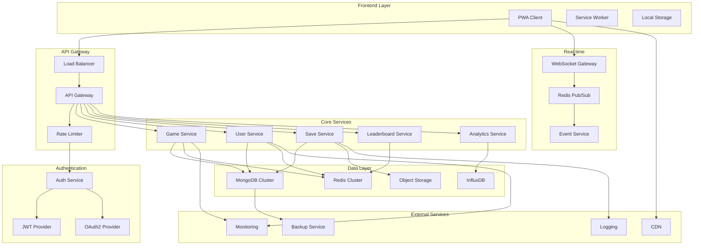

# 🏗️ Backend Coordination Plan - Llama Wool Farm

## 🎯 Executive Summary

This document outlines the comprehensive backend architecture coordination plan for Llama Wool Farm, transforming the current frontend-focused PWA into a scalable, production-ready system with full backend services integration.

## 📊 Current State Analysis

### Existing Architecture
- **Frontend**: TypeScript + Phaser.js 3.80 + React 18.2
- **State Management**: Redux Toolkit + Local Storage
- **Build**: Webpack 5 with PWA optimizations
- **Deployment**: Static hosting (Netlify)
- **Data**: Browser-only local storage

### Identified Gaps
1. **No backend services** - Currently client-only
2. **No user authentication** - Local-only sessions
3. **No cloud persistence** - Data loss on device clear
4. **No real-time features** - No multiplayer or live updates
5. **No scaling strategy** - Single-player only
6. **No analytics backend** - Limited insights
7. **No content management** - Static content only

## 🏗️ Backend Architecture Overview



## 🔧 System Integration Strategy

### 1. Service Architecture Design

#### Core Services
```typescript
// Game Service - Core game logic validation
interface GameService {
  validateAction(userId: string, action: GameAction): Promise<ValidationResult>;
  processOfflineProgress(userId: string, lastSeen: Date): Promise<OfflineData>;
  calculateProduction(gameState: GameState): Promise<ProductionResult>;
  validatePrestige(gameState: GameState): Promise<PrestigeResult>;
}

// User Service - Profile and authentication
interface UserService {
  createProfile(authData: AuthData): Promise<UserProfile>;
  updateProfile(userId: string, updates: Partial<UserProfile>): Promise<UserProfile>;
  getProfile(userId: string): Promise<UserProfile>;
  deleteProfile(userId: string): Promise<void>;
}

// Save Service - Game state persistence
interface SaveService {
  saveGameState(userId: string, gameState: GameState): Promise<SaveResult>;
  loadGameState(userId: string): Promise<GameState>;
  createBackup(userId: string): Promise<BackupResult>;
  restoreBackup(userId: string, backupId: string): Promise<GameState>;
}

// Leaderboard Service - Competitive features
interface LeaderboardService {
  updateScore(userId: string, scoreType: string, value: number): Promise<void>;
  getLeaderboard(type: string, limit: number): Promise<LeaderboardEntry[]>;
  getUserRank(userId: string, type: string): Promise<RankInfo>;
}
```

#### Service Boundaries
- **Game Service**: Authoritative game logic, anti-cheat validation
- **User Service**: Profile management, preferences, social features
- **Save Service**: State persistence, backup/restore, conflict resolution
- **Leaderboard Service**: Competition, rankings, achievements
- **Analytics Service**: Player behavior, game metrics, business intelligence

### 2. Data Flow Coordination

#### Game State Synchronization
```typescript
// Client-Server Sync Pattern
class GameStateSyncManager {
  private conflictResolver: ConflictResolver;
  private validator: GameStateValidator;
  
  async syncGameState(localState: GameState): Promise<SyncResult> {
    const serverState = await this.saveService.loadGameState(userId);
    
    if (this.hasConflict(localState, serverState)) {
      const resolved = await this.conflictResolver.resolve(localState, serverState);
      return this.validator.validate(resolved);
    }
    
    return this.saveService.saveGameState(userId, localState);
  }
}
```

#### Real-time Event Coordination
```typescript
// WebSocket Event System
class EventCoordinator {
  private pubsub: RedisPubSub;
  private rateLimiter: RateLimiter;
  
  async broadcastEvent(event: GameEvent): Promise<void> {
    if (await this.rateLimiter.checkLimit(event.userId)) {
      await this.pubsub.publish(`game:${event.type}`, event);
    }
  }
  
  async subscribeToEvents(userId: string, callback: EventCallback): Promise<void> {
    await this.pubsub.subscribe(`user:${userId}:events`, callback);
  }
}
```

## 🚀 Scaling Strategy

### Horizontal Scaling Architecture

#### Load Balancing Configuration
```yaml
# Load Balancer Rules
upstream game_servers {
  server game-1:3000 weight=3;
  server game-2:3000 weight=3;
  server game-3:3000 weight=2;
  
  # Health checks
  health_check interval=30s fails=3 passes=2;
}

upstream websocket_servers {
  server ws-1:3001;
  server ws-2:3001;
  
  # Sticky sessions for WebSocket
  sticky_session $remote_addr;
}
```

#### Auto-scaling Triggers
```typescript
// Kubernetes HPA Configuration
interface AutoScalingConfig {
  minReplicas: 2;
  maxReplicas: 20;
  targetCPUUtilization: 70;
  targetMemoryUtilization: 80;
  
  customMetrics: {
    activeUsers: { target: 1000, scale: 2 };
    requestsPerSecond: { target: 500, scale: 1.5 };
    websocketConnections: { target: 5000, scale: 3 };
  };
}
```

### Database Scaling Strategy

#### MongoDB Sharding
```javascript
// Sharding Configuration
sh.addShard("shard01/mongo-1:27017,mongo-2:27017,mongo-3:27017");
sh.addShard("shard02/mongo-4:27017,mongo-5:27017,mongo-6:27017");
sh.addShard("shard03/mongo-7:27017,mongo-8:27017,mongo-9:27017");

// Shard key selection
sh.shardCollection("llamawool.users", { "userId": 1 });
sh.shardCollection("llamawool.gameStates", { "userId": 1 });
sh.shardCollection("llamawool.leaderboards", { "type": 1, "score": -1 });
```

#### Redis Cluster
```yaml
# Redis Cluster Configuration
nodes:
  - redis-1:7000
  - redis-2:7000
  - redis-3:7000
  - redis-4:7000
  - redis-5:7000
  - redis-6:7000

cluster:
  replicas: 1
  failover_timeout: 5000
  node_timeout: 15000
```

## 🐳 Deployment Architecture

### Containerization Strategy

#### Docker Configuration
```dockerfile
# Game Service Dockerfile
FROM node:18-alpine AS builder
WORKDIR /app
COPY package*.json ./
RUN npm ci --only=production

FROM node:18-alpine
WORKDIR /app
COPY --from=builder /app/node_modules ./node_modules
COPY . .
EXPOSE 3000
CMD ["node", "dist/server.js"]
```

#### Kubernetes Deployment
```yaml
# Game Service Deployment
apiVersion: apps/v1
kind: Deployment
metadata:
  name: game-service
spec:
  replicas: 3
  selector:
    matchLabels:
      app: game-service
  template:
    metadata:
      labels:
        app: game-service
    spec:
      containers:
      - name: game-service
        image: llamawool/game-service:latest
        ports:
        - containerPort: 3000
        env:
        - name: MONGODB_URI
          valueFrom:
            secretKeyRef:
              name: db-secret
              key: mongodb-uri
        - name: REDIS_URI
          valueFrom:
            secretKeyRef:
              name: cache-secret
              key: redis-uri
        resources:
          requests:
            cpu: 100m
            memory: 256Mi
          limits:
            cpu: 500m
            memory: 512Mi
        livenessProbe:
          httpGet:
            path: /health
            port: 3000
          initialDelaySeconds: 30
          periodSeconds: 10
        readinessProbe:
          httpGet:
            path: /ready
            port: 3000
          initialDelaySeconds: 5
          periodSeconds: 5
```

### CI/CD Pipeline Design

#### GitHub Actions Workflow
```yaml
name: Backend Deployment
on:
  push:
    branches: [main]
    paths: ['backend/**']

jobs:
  test:
    runs-on: ubuntu-latest
    steps:
    - uses: actions/checkout@v3
    - uses: actions/setup-node@v3
      with:
        node-version: '18'
    - run: npm ci
    - run: npm run test:unit
    - run: npm run test:integration
    - run: npm run test:e2e
    
  build:
    needs: test
    runs-on: ubuntu-latest
    steps:
    - uses: actions/checkout@v3
    - name: Build Docker images
      run: |
        docker build -t llamawool/game-service:${{ github.sha }} .
        docker build -t llamawool/user-service:${{ github.sha }} .
        docker build -t llamawool/save-service:${{ github.sha }} .
    
  deploy:
    needs: build
    runs-on: ubuntu-latest
    environment: production
    steps:
    - name: Deploy to Kubernetes
      run: |
        kubectl set image deployment/game-service game-service=llamawool/game-service:${{ github.sha }}
        kubectl set image deployment/user-service user-service=llamawool/user-service:${{ github.sha }}
        kubectl set image deployment/save-service save-service=llamawool/save-service:${{ github.sha }}
        kubectl rollout status deployment/game-service
        kubectl rollout status deployment/user-service
        kubectl rollout status deployment/save-service
```

## 🔍 Performance Optimization

### Caching Layer Design

#### Multi-level Caching
```typescript
// Cache Strategy Implementation
class CacheManager {
  private l1Cache: MemoryCache;    // In-memory (fastest)
  private l2Cache: RedisCache;     // Redis (fast)
  private l3Cache: DatabaseCache;  // Database (persistent)
  
  async get<T>(key: string): Promise<T | null> {
    // L1 Cache (Memory)
    let result = await this.l1Cache.get<T>(key);
    if (result) return result;
    
    // L2 Cache (Redis)
    result = await this.l2Cache.get<T>(key);
    if (result) {
      await this.l1Cache.set(key, result, 300); // 5 min TTL
      return result;
    }
    
    // L3 Cache (Database)
    result = await this.l3Cache.get<T>(key);
    if (result) {
      await this.l2Cache.set(key, result, 3600); // 1 hour TTL
      await this.l1Cache.set(key, result, 300);  // 5 min TTL
      return result;
    }
    
    return null;
  }
}
```

#### Cache Invalidation Strategy
```typescript
// Cache Invalidation Patterns
class CacheInvalidator {
  async invalidateUserData(userId: string): Promise<void> {
    const patterns = [
      `user:${userId}:*`,
      `gamestate:${userId}:*`,
      `leaderboard:*:${userId}`,
      `analytics:${userId}:*`
    ];
    
    await Promise.all(patterns.map(pattern => 
      this.redisClient.del(pattern)
    ));
  }
  
  async invalidateLeaderboard(type: string): Promise<void> {
    await this.redisClient.del(`leaderboard:${type}:*`);
    await this.pubsub.publish('invalidate:leaderboard', { type });
  }
}
```

### Database Optimization

#### Query Optimization
```typescript
// Optimized Database Queries
class OptimizedQueries {
  // Efficient user lookup with projection
  async getUserProfile(userId: string): Promise<UserProfile> {
    return await this.userCollection.findOne(
      { userId },
      { projection: { _id: 0, password: 0, internalFields: 0 } }
    );
  }
  
  // Batch operations for efficiency
  async batchUpdateScores(updates: ScoreUpdate[]): Promise<void> {
    const bulkOps = updates.map(update => ({
      updateOne: {
        filter: { userId: update.userId },
        update: { $set: { score: update.score, updatedAt: new Date() } },
        upsert: true
      }
    }));
    
    await this.leaderboardCollection.bulkWrite(bulkOps);
  }
  
  // Aggregation pipeline for complex queries
  async getTopPlayers(limit: number = 100): Promise<LeaderboardEntry[]> {
    return await this.leaderboardCollection.aggregate([
      { $match: { active: true } },
      { $sort: { score: -1 } },
      { $limit: limit },
      { $lookup: {
          from: 'users',
          localField: 'userId',
          foreignField: 'userId',
          as: 'userInfo'
      }},
      { $unwind: '$userInfo' },
      { $project: {
          userId: 1,
          score: 1,
          rank: { $add: [{ $indexOfArray: ['$userId', '$userId'] }, 1] },
          username: '$userInfo.username',
          avatar: '$userInfo.avatar'
      }}
    ]).toArray();
  }
}
```

## 🛡️ Monitoring & Observability

### Comprehensive Monitoring Stack

#### Health Check System
```typescript
// Health Check Implementation
class HealthChecker {
  private checks: HealthCheck[] = [];
  
  async checkHealth(): Promise<HealthReport> {
    const results = await Promise.allSettled(
      this.checks.map(check => check.execute())
    );
    
    const report: HealthReport = {
      status: 'healthy',
      timestamp: new Date(),
      checks: []
    };
    
    results.forEach((result, index) => {
      const check = this.checks[index];
      if (result.status === 'fulfilled') {
        report.checks.push({
          name: check.name,
          status: result.value.status,
          responseTime: result.value.responseTime,
          message: result.value.message
        });
      } else {
        report.status = 'unhealthy';
        report.checks.push({
          name: check.name,
          status: 'failed',
          responseTime: 0,
          message: result.reason.message
        });
      }
    });
    
    return report;
  }
}
```

#### Metrics Collection
```typescript
// Metrics Collection System
class MetricsCollector {
  private prometheus: PrometheusRegistry;
  
  // Business metrics
  gameActionsCounter = new Counter({
    name: 'game_actions_total',
    help: 'Total number of game actions',
    labelNames: ['action_type', 'user_id']
  });
  
  userRegistrationGauge = new Gauge({
    name: 'user_registrations_total',
    help: 'Total number of user registrations'
  });
  
  // Technical metrics
  requestDurationHistogram = new Histogram({
    name: 'http_request_duration_seconds',
    help: 'HTTP request duration in seconds',
    labelNames: ['method', 'route', 'status_code']
  });
  
  databaseConnectionGauge = new Gauge({
    name: 'database_connections_active',
    help: 'Number of active database connections'
  });
  
  // Custom metrics
  woolProductionRate = new Gauge({
    name: 'wool_production_rate',
    help: 'Current wool production rate across all players',
    labelNames: ['wool_type']
  });
}
```

### Alerting Strategy

#### Alert Configuration
```yaml
# Prometheus Alert Rules
groups:
- name: llamawool.rules
  rules:
  - alert: HighErrorRate
    expr: rate(http_requests_total{status=~"5.."}[5m]) > 0.1
    for: 5m
    labels:
      severity: critical
    annotations:
      summary: "High error rate detected"
      description: "Error rate is {{ $value }} requests/second"
  
  - alert: DatabaseConnectionIssue
    expr: database_connections_active < 1
    for: 2m
    labels:
      severity: warning
    annotations:
      summary: "Database connection issue"
      description: "Database connections below minimum threshold"
  
  - alert: UserRegistrationSpike
    expr: increase(user_registrations_total[1h]) > 1000
    for: 0m
    labels:
      severity: info
    annotations:
      summary: "User registration spike detected"
      description: "{{ $value }} new users registered in the last hour"
```

## 🔄 Maintenance & Operations

### Backup Strategy

#### Automated Backup System
```typescript
// Backup Manager
class BackupManager {
  private s3Client: S3Client;
  private scheduler: CronScheduler;
  
  async scheduleBackups(): Promise<void> {
    // Full backup daily at 2 AM
    this.scheduler.schedule('0 2 * * *', async () => {
      await this.createFullBackup();
    });
    
    // Incremental backup every 6 hours
    this.scheduler.schedule('0 */6 * * *', async () => {
      await this.createIncrementalBackup();
    });
    
    // Game state backup every hour
    this.scheduler.schedule('0 * * * *', async () => {
      await this.backupGameStates();
    });
  }
  
  async createFullBackup(): Promise<BackupResult> {
    const timestamp = new Date().toISOString();
    const backupId = `full-backup-${timestamp}`;
    
    try {
      // Backup MongoDB
      const mongoBackup = await this.backupMongoDB();
      await this.uploadToS3(mongoBackup, `${backupId}/mongodb.tar.gz`);
      
      // Backup Redis
      const redisBackup = await this.backupRedis();
      await this.uploadToS3(redisBackup, `${backupId}/redis.rdb`);
      
      // Backup configuration
      const configBackup = await this.backupConfiguration();
      await this.uploadToS3(configBackup, `${backupId}/config.json`);
      
      return { status: 'success', backupId, timestamp };
    } catch (error) {
      return { status: 'failed', error: error.message, timestamp };
    }
  }
}
```

### Deployment Procedures

#### Rolling Deployment Strategy
```typescript
// Rolling Deployment Manager
class DeploymentManager {
  private k8sClient: KubernetesClient;
  private healthChecker: HealthChecker;
  
  async rollingDeploy(service: string, image: string): Promise<DeploymentResult> {
    try {
      // Update deployment image
      await this.k8sClient.updateDeployment(service, { image });
      
      // Monitor rollout
      const rolloutStatus = await this.monitorRollout(service);
      
      if (rolloutStatus.success) {
        // Verify health after deployment
        const healthCheck = await this.healthChecker.checkServiceHealth(service);
        
        if (healthCheck.status === 'healthy') {
          return { status: 'success', service, image };
        } else {
          // Auto-rollback on health check failure
          await this.rollback(service);
          return { status: 'failed', error: 'Health check failed, rolled back' };
        }
      } else {
        return { status: 'failed', error: rolloutStatus.error };
      }
    } catch (error) {
      return { status: 'failed', error: error.message };
    }
  }
  
  async rollback(service: string): Promise<void> {
    await this.k8sClient.rollbackDeployment(service);
    await this.monitorRollout(service);
  }
}
```

## 🎯 Implementation Roadmap

### Phase 1: Foundation (Weeks 1-4)
- [ ] Set up development environment
- [ ] Implement basic Express.js API server
- [ ] Create MongoDB connection and basic schemas
- [ ] Set up Redis for caching
- [ ] Implement JWT authentication
- [ ] Create basic user registration/login
- [ ] Set up Docker containerization
- [ ] Create CI/CD pipeline

### Phase 2: Core Services (Weeks 5-8)
- [ ] Implement Game Service with validation
- [ ] Create Save Service with conflict resolution
- [ ] Build User Service with profile management
- [ ] Implement basic Leaderboard Service
- [ ] Add WebSocket support for real-time features
- [ ] Create comprehensive test suite
- [ ] Set up monitoring and logging
- [ ] Deploy to staging environment

### Phase 3: Advanced Features (Weeks 9-12)
- [ ] Implement analytics and metrics collection
- [ ] Add advanced caching strategies
- [ ] Create backup and disaster recovery
- [ ] Implement auto-scaling
- [ ] Add advanced security features
- [ ] Performance optimization
- [ ] Load testing and optimization
- [ ] Production deployment

### Phase 4: Optimization (Weeks 13-16)
- [ ] Database sharding implementation
- [ ] Advanced monitoring and alerting
- [ ] Performance tuning
- [ ] Security hardening
- [ ] Documentation completion
- [ ] Team training and handover

## 🚀 Success Metrics

### Technical Metrics
- **API Response Time**: < 100ms for 95% of requests
- **Database Query Time**: < 50ms for 99% of queries
- **Uptime**: 99.9% availability
- **Error Rate**: < 0.1% of all requests
- **Throughput**: 10,000+ requests per second
- **Concurrent Users**: 50,000+ simultaneous users

### Business Metrics
- **User Retention**: 80% day-1, 40% day-7, 20% day-30
- **Data Loss**: 0% game state loss
- **Performance Score**: 95+ Lighthouse score maintained
- **Security**: 0 critical vulnerabilities
- **Scalability**: Auto-scale to 100x load within 5 minutes

## 📋 Next Steps

1. **Immediate Actions**:
   - Create backend service directory structure
   - Set up development environment
   - Initialize Git repository for backend services
   - Create basic Docker configuration

2. **Short-term Goals**:
   - Implement authentication service
   - Create database schemas and models
   - Set up basic API endpoints
   - Implement save/load functionality

3. **Medium-term Objectives**:
   - Deploy to staging environment
   - Implement monitoring and logging
   - Add real-time features
   - Performance optimization

4. **Long-term Vision**:
   - Full production deployment
   - Advanced features (multiplayer, events)
   - Mobile app backend support
   - Global scaling capabilities

---

This coordination plan provides a comprehensive roadmap for transforming Llama Wool Farm from a client-only PWA to a fully-featured, scalable backend system. The architecture is designed for growth, maintainability, and performance while ensuring security and reliability.