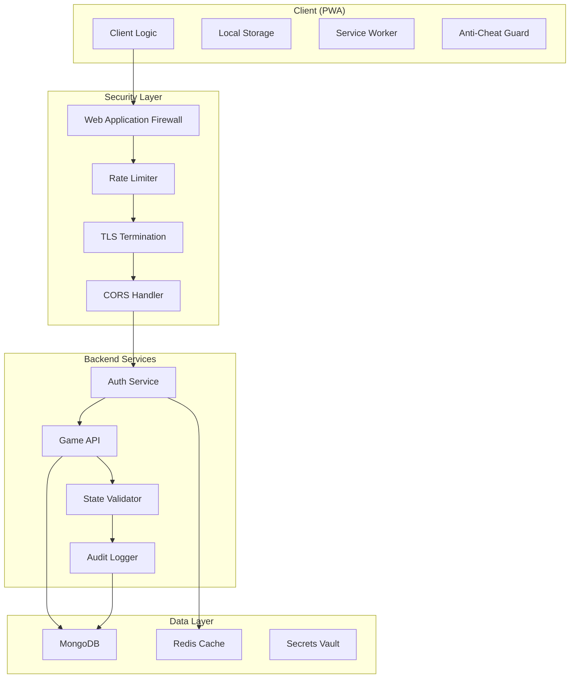

# 🔐 Security Architecture - Llama Wool Farm

## Overview

This document outlines the comprehensive security architecture for Llama Wool Farm, focusing on protecting against cheating, ensuring data integrity, and maintaining system security in an idle clicker game environment.

## 🎯 Security Objectives

1. **Anti-Cheat Protection**: Prevent game state manipulation and progression cheating
2. **Data Integrity**: Ensure save data authenticity and consistency
3. **Authentication Security**: Secure user authentication and session management
4. **API Security**: Protect backend services from abuse and attacks
5. **Privacy Protection**: Safeguard user data and analytics

## 🏗️ Security Architecture Overview



## 🔐 1. JWT Authentication System

### Token Strategy
```typescript
interface JWTPayload {
  userId: string;
  sessionId: string;
  deviceId: string;
  iat: number;
  exp: number;
  aud: string;
  iss: string;
}

interface RefreshTokenPayload {
  userId: string;
  sessionId: string;
  deviceId: string;
  tokenVersion: number;
  iat: number;
  exp: number;
}
```

### Implementation
```typescript
// auth/jwt.service.ts
import jwt from 'jsonwebtoken';
import bcrypt from 'bcryptjs';
import { randomBytes } from 'crypto';

export class JWTService {
  private readonly accessTokenSecret = process.env.JWT_ACCESS_SECRET!;
  private readonly refreshTokenSecret = process.env.JWT_REFRESH_SECRET!;
  private readonly accessTokenExpiry = '15m';
  private readonly refreshTokenExpiry = '30d';

  async generateTokenPair(userId: string, deviceId: string): Promise<TokenPair> {
    const sessionId = randomBytes(32).toString('hex');
    
    const accessToken = jwt.sign(
      { userId, sessionId, deviceId },
      this.accessTokenSecret,
      { 
        expiresIn: this.accessTokenExpiry,
        issuer: 'llama-wool-farm',
        audience: 'game-client'
      }
    );

    const refreshToken = jwt.sign(
      { userId, sessionId, deviceId, tokenVersion: 1 },
      this.refreshTokenSecret,
      { expiresIn: this.refreshTokenExpiry }
    );

    // Store session in Redis
    await this.storeSession(sessionId, userId, deviceId);

    return { accessToken, refreshToken, sessionId };
  }

  async validateAccessToken(token: string): Promise<JWTPayload> {
    try {
      const payload = jwt.verify(token, this.accessTokenSecret) as JWTPayload;
      
      // Verify session exists
      const sessionExists = await this.verifySession(payload.sessionId);
      if (!sessionExists) {
        throw new Error('Session invalid');
      }

      return payload;
    } catch (error) {
      throw new Error('Invalid access token');
    }
  }

  async refreshTokens(refreshToken: string): Promise<TokenPair> {
    const payload = jwt.verify(refreshToken, this.refreshTokenSecret) as RefreshTokenPayload;
    
    // Verify session and token version
    const session = await this.getSession(payload.sessionId);
    if (!session || session.tokenVersion !== payload.tokenVersion) {
      throw new Error('Invalid refresh token');
    }

    return this.generateTokenPair(payload.userId, payload.deviceId);
  }

  async revokeSession(sessionId: string): Promise<void> {
    await this.redisClient.del(`session:${sessionId}`);
  }

  private async storeSession(sessionId: string, userId: string, deviceId: string): Promise<void> {
    await this.redisClient.setex(`session:${sessionId}`, 86400 * 30, JSON.stringify({
      userId,
      deviceId,
      tokenVersion: 1,
      createdAt: Date.now()
    }));
  }
}
```

### Password Security
```typescript
// auth/password.service.ts
import bcrypt from 'bcryptjs';
import argon2 from 'argon2';

export class PasswordService {
  private readonly saltRounds = 12;

  async hashPassword(password: string): Promise<string> {
    // Use Argon2 for new passwords (more secure)
    return argon2.hash(password, {
      type: argon2.argon2id,
      memoryCost: 65536, // 64 MB
      timeCost: 3,
      parallelism: 4,
    });
  }

  async verifyPassword(password: string, hash: string): Promise<boolean> {
    try {
      // Try Argon2 first
      if (hash.startsWith('$argon2')) {
        return argon2.verify(hash, password);
      }
      
      // Fallback to bcrypt for legacy passwords
      return bcrypt.compare(password, hash);
    } catch (error) {
      return false;
    }
  }

  async needsRehash(hash: string): Promise<boolean> {
    return !hash.startsWith('$argon2');
  }
}
```

## 🛡️ 2. Anti-Cheat Measures

### Server-Side Validation
```typescript
// anti-cheat/state-validator.ts
import { GameSave, WoolType, BuildingType } from '../types/game.types';
import { Decimal } from 'decimal.js';

export class StateValidator {
  private readonly MAX_OFFLINE_HOURS = 24;
  private readonly MAX_PRODUCTION_MULTIPLIER = 1e12;
  private readonly SUSPICIOUS_THRESHOLD = 0.95;

  async validateGameState(
    previousState: GameSave,
    currentState: GameSave,
    timeDelta: number
  ): Promise<ValidationResult> {
    const results: ValidationResult = {
      isValid: true,
      suspiciousActivity: [],
      violations: [],
      confidenceScore: 1.0
    };

    // 1. Time-based validation
    await this.validateTimeProgression(previousState, currentState, timeDelta, results);

    // 2. Production validation
    await this.validateProduction(previousState, currentState, timeDelta, results);

    // 3. Resource validation
    await this.validateResources(previousState, currentState, results);

    // 4. Building progression validation
    await this.validateBuildingProgression(previousState, currentState, results);

    // 5. Achievement validation
    await this.validateAchievements(previousState, currentState, results);

    // Calculate final confidence score
    results.confidenceScore = this.calculateConfidenceScore(results);
    results.isValid = results.confidenceScore > this.SUSPICIOUS_THRESHOLD;

    return results;
  }

  private async validateTimeProgression(
    prev: GameSave,
    curr: GameSave,
    timeDelta: number,
    results: ValidationResult
  ): Promise<void> {
    // Check for impossible time jumps
    if (timeDelta > this.MAX_OFFLINE_HOURS * 3600 * 1000) {
      results.violations.push({
        type: 'TIME_JUMP',
        severity: 'HIGH',
        message: `Impossible time jump: ${timeDelta / 1000 / 3600}h`
      });
    }

    // Check for negative time progression
    if (curr.timestamp < prev.timestamp) {
      results.violations.push({
        type: 'TIME_REGRESSION',
        severity: 'HIGH',
        message: 'Timestamp moved backwards'
      });
    }

    // Check for suspicious playtime increases
    const playtimeIncrease = curr.playTime - prev.playTime;
    if (playtimeIncrease > timeDelta * 1.1) {
      results.suspiciousActivity.push({
        type: 'PLAYTIME_ANOMALY',
        severity: 'MEDIUM',
        message: 'Playtime increased more than real time'
      });
    }
  }

  private async validateProduction(
    prev: GameSave,
    curr: GameSave,
    timeDelta: number,
    results: ValidationResult
  ): Promise<void> {
    // Calculate expected production
    const expectedProduction = await this.calculateExpectedProduction(prev, timeDelta);
    
    // Check each wool type
    Object.values(WoolType).forEach(woolType => {
      const prevAmount = new Decimal(prev.woolCounts[woolType] || '0');
      const currAmount = new Decimal(curr.woolCounts[woolType] || '0');
      const actualGain = currAmount.minus(prevAmount);
      const expectedGain = expectedProduction[woolType];
      
      // Allow 10% tolerance for floating point errors
      const tolerance = expectedGain.mul(0.1);
      const maxAllowed = expectedGain.plus(tolerance);
      
      if (actualGain.gt(maxAllowed)) {
        results.violations.push({
          type: 'PRODUCTION_OVERFLOW',
          severity: 'HIGH',
          message: `${woolType} production exceeded maximum: ${actualGain.toString()} > ${maxAllowed.toString()}`
        });
      }
    });
  }

  private async validateResources(
    prev: GameSave,
    curr: GameSave,
    results: ValidationResult
  ): Promise<void> {
    // Check for impossible resource increases
    const prevSoulShears = new Decimal(prev.soulShears);
    const currSoulShears = new Decimal(curr.soulShears);
    
    if (currSoulShears.gt(prevSoulShears)) {
      // Soul shears can only increase through prestige
      if (curr.totalPrestiges === prev.totalPrestiges) {
        results.violations.push({
          type: 'INVALID_CURRENCY_GAIN',
          severity: 'HIGH',
          message: 'Soul shears increased without prestige'
        });
      }
    }

    // Check for negative resources
    Object.values(WoolType).forEach(woolType => {
      const amount = new Decimal(curr.woolCounts[woolType] || '0');
      if (amount.lt(0)) {
        results.violations.push({
          type: 'NEGATIVE_RESOURCE',
          severity: 'HIGH',
          message: `Negative ${woolType} amount: ${amount.toString()}`
        });
      }
    });
  }

  private async calculateExpectedProduction(
    state: GameSave,
    timeDelta: number
  ): Promise<Record<WoolType, Decimal>> {
    // Implement server-side production calculation
    const production: Record<WoolType, Decimal> = {} as any;
    
    // Calculate based on buildings, upgrades, and multipliers
    Object.values(WoolType).forEach(woolType => {
      let baseProduction = new Decimal(0);
      
      // Add building contributions
      Object.values(BuildingType).forEach(buildingType => {
        const building = state.buildings[buildingType];
        if (building.unlocked) {
          const buildingProduction = building.baseProduction
            .mul(building.productionMultiplier)
            .mul(building.level);
          baseProduction = baseProduction.plus(buildingProduction);
        }
      });
      
      // Apply global multipliers
      const totalMultiplier = this.calculateTotalMultiplier(state);
      
      // Calculate production over time
      const timeInSeconds = timeDelta / 1000;
      production[woolType] = baseProduction.mul(totalMultiplier).mul(timeInSeconds);
    });
    
    return production;
  }

  private calculateTotalMultiplier(state: GameSave): Decimal {
    let multiplier = new Decimal(1);
    
    // Add upgrade multipliers
    state.purchasedUpgrades.forEach(upgradeId => {
      const upgrade = this.getUpgradeById(upgradeId);
      if (upgrade?.effect.type === 'multiply' && upgrade.effect.target === 'production') {
        multiplier = multiplier.mul(upgrade.effect.value);
      }
    });
    
    // Add prestige multiplier
    const prestigeMultiplier = new Decimal(1.1).pow(state.totalPrestiges);
    multiplier = multiplier.mul(prestigeMultiplier);
    
    return multiplier;
  }

  private calculateConfidenceScore(results: ValidationResult): number {
    let score = 1.0;
    
    // Reduce score for violations
    results.violations.forEach(violation => {
      switch (violation.severity) {
        case 'HIGH':
          score -= 0.3;
          break;
        case 'MEDIUM':
          score -= 0.15;
          break;
        case 'LOW':
          score -= 0.05;
          break;
      }
    });
    
    // Reduce score for suspicious activity
    results.suspiciousActivity.forEach(activity => {
      switch (activity.severity) {
        case 'HIGH':
          score -= 0.2;
          break;
        case 'MEDIUM':
          score -= 0.1;
          break;
        case 'LOW':
          score -= 0.02;
          break;
      }
    });
    
    return Math.max(0, score);
  }
}

interface ValidationResult {
  isValid: boolean;
  suspiciousActivity: SecurityEvent[];
  violations: SecurityEvent[];
  confidenceScore: number;
}

interface SecurityEvent {
  type: string;
  severity: 'HIGH' | 'MEDIUM' | 'LOW';
  message: string;
}
```

### Statistical Anomaly Detection
```typescript
// anti-cheat/anomaly-detector.ts
export class AnomalyDetector {
  private readonly redis: Redis;
  private readonly WINDOW_SIZE = 24 * 60 * 60 * 1000; // 24 hours

  async detectAnomalies(userId: string, gameState: GameSave): Promise<AnomalyReport> {
    const report: AnomalyReport = {
      anomalies: [],
      riskScore: 0,
      recommendations: []
    };

    // Get historical data
    const history = await this.getPlayerHistory(userId);
    
    // Check progression rate anomalies
    await this.checkProgressionRateAnomalies(history, gameState, report);
    
    // Check resource accumulation patterns
    await this.checkResourcePatterns(history, gameState, report);
    
    // Check session patterns
    await this.checkSessionPatterns(history, gameState, report);
    
    return report;
  }

  private async checkProgressionRateAnomalies(
    history: GameSave[],
    current: GameSave,
    report: AnomalyReport
  ): Promise<void> {
    if (history.length < 10) return; // Need sufficient history

    // Calculate progression rates
    const progressionRates = history.slice(-10).map((save, index) => {
      if (index === 0) return 0;
      
      const prev = history[index - 1];
      const timeDelta = save.timestamp - prev.timestamp;
      const woolGain = new Decimal(save.totalWoolProduced).minus(prev.totalWoolProduced);
      
      return woolGain.div(timeDelta).toNumber();
    });

    // Statistical analysis
    const mean = progressionRates.reduce((sum, rate) => sum + rate, 0) / progressionRates.length;
    const stdDev = Math.sqrt(
      progressionRates.reduce((sum, rate) => sum + Math.pow(rate - mean, 2), 0) / progressionRates.length
    );

    // Check current rate against historical pattern
    const currentIndex = history.length - 1;
    const currentRate = progressionRates[currentIndex];
    const zScore = Math.abs((currentRate - mean) / stdDev);

    if (zScore > 3) { // 3 standard deviations
      report.anomalies.push({
        type: 'PROGRESSION_SPIKE',
        severity: 'HIGH',
        confidence: Math.min(zScore / 3, 1),
        message: `Progression rate ${zScore.toFixed(2)} standard deviations above normal`
      });
    }
  }

  private async checkResourcePatterns(
    history: GameSave[],
    current: GameSave,
    report: AnomalyReport
  ): Promise<void> {
    // Check for impossible resource ratios
    const totalWool = Object.values(WoolType).reduce((sum, type) => {
      return sum.plus(new Decimal(current.woolCounts[type] || '0'));
    }, new Decimal(0));

    const playTimeHours = current.playTime / 1000 / 3600;
    const woolPerHour = totalWool.div(playTimeHours);

    // Compare with theoretical maximum
    const maxTheoreticalRate = await this.calculateMaxTheoreticalRate(current);
    
    if (woolPerHour.gt(maxTheoreticalRate.mul(1.1))) {
      report.anomalies.push({
        type: 'IMPOSSIBLE_RATE',
        severity: 'HIGH',
        confidence: 0.95,
        message: `Production rate exceeds theoretical maximum`
      });
    }
  }

  private async calculateMaxTheoreticalRate(state: GameSave): Promise<Decimal> {
    // Calculate theoretical maximum production with perfect play
    // This is a simplified version - in reality, you'd need complex calculations
    let maxRate = new Decimal(0);
    
    // Add maximum possible building contributions
    Object.values(BuildingType).forEach(buildingType => {
      const building = state.buildings[buildingType];
      if (building.unlocked) {
        const maxProduction = building.baseProduction.mul(building.level);
        maxRate = maxRate.plus(maxProduction);
      }
    });
    
    // Apply maximum possible multipliers
    const maxMultiplier = new Decimal(10).pow(state.totalPrestiges); // Exponential prestige bonus
    
    return maxRate.mul(maxMultiplier);
  }
}

interface AnomalyReport {
  anomalies: Anomaly[];
  riskScore: number;
  recommendations: string[];
}

interface Anomaly {
  type: string;
  severity: 'HIGH' | 'MEDIUM' | 'LOW';
  confidence: number;
  message: string;
}
```

## 🚦 3. Rate Limiting & DDoS Protection

### Multi-Layer Rate Limiting
```typescript
// security/rate-limiter.ts
import { rateLimit } from 'express-rate-limit';
import { RedisStore } from 'rate-limit-redis';
import Redis from 'ioredis';

export class RateLimiter {
  private readonly redis: Redis;

  constructor() {
    this.redis = new Redis(process.env.REDIS_URL);
  }

  // Global rate limiter
  createGlobalLimiter() {
    return rateLimit({
      store: new RedisStore({
        client: this.redis,
        prefix: 'global:',
      }),
      windowMs: 15 * 60 * 1000, // 15 minutes
      max: 1000, // limit each IP to 1000 requests per windowMs
      message: {
        error: 'Too many requests from this IP, please try again later.',
        retryAfter: 15 * 60
      },
      standardHeaders: true,
      legacyHeaders: false,
    });
  }

  // API endpoint specific limiters
  createAuthLimiter() {
    return rateLimit({
      store: new RedisStore({
        client: this.redis,
        prefix: 'auth:',
      }),
      windowMs: 15 * 60 * 1000, // 15 minutes
      max: 10, // limit each IP to 10 login attempts per windowMs
      message: {
        error: 'Too many login attempts, please try again later.',
        retryAfter: 15 * 60
      },
      skipSuccessfulRequests: true,
    });
  }

  createGameStateLimiter() {
    return rateLimit({
      store: new RedisStore({
        client: this.redis,
        prefix: 'gamestate:',
      }),
      windowMs: 60 * 1000, // 1 minute
      max: 60, // limit each user to 60 game state updates per minute
      keyGenerator: (req) => req.user?.id || req.ip,
      message: {
        error: 'Too many game state updates, please slow down.',
        retryAfter: 60
      },
    });
  }

  // Adaptive rate limiting based on user behavior
  async createAdaptiveLimiter(userId: string): Promise<number> {
    const key = `adaptive:${userId}`;
    const userStats = await this.redis.hgetall(key);
    
    const suspiciousActivity = parseInt(userStats.suspicious || '0');
    const violationCount = parseInt(userStats.violations || '0');
    
    // Calculate dynamic limit based on user's security score
    let baseLimit = 100; // requests per minute
    
    if (suspiciousActivity > 5) {
      baseLimit = Math.max(10, baseLimit - (suspiciousActivity * 5));
    }
    
    if (violationCount > 3) {
      baseLimit = Math.max(5, baseLimit - (violationCount * 10));
    }
    
    return baseLimit;
  }

  // Connection-based rate limiting
  async checkConnectionLimits(ip: string): Promise<boolean> {
    const key = `conn:${ip}`;
    const connections = await this.redis.get(key);
    
    if (!connections) {
      await this.redis.setex(key, 60, '1');
      return true;
    }
    
    const count = parseInt(connections);
    if (count >= 10) { // Max 10 concurrent connections per IP
      return false;
    }
    
    await this.redis.incr(key);
    return true;
  }

  // Resource-based limiting
  async checkResourceLimits(userId: string, resource: string): Promise<boolean> {
    const key = `resource:${userId}:${resource}`;
    const usage = await this.redis.get(key);
    
    const limits = {
      'cpu': 100, // CPU units per minute
      'memory': 50, // Memory operations per minute
      'storage': 10 // Storage operations per minute
    };
    
    const limit = limits[resource as keyof typeof limits] || 50;
    
    if (!usage) {
      await this.redis.setex(key, 60, '1');
      return true;
    }
    
    const count = parseInt(usage);
    if (count >= limit) {
      return false;
    }
    
    await this.redis.incr(key);
    return true;
  }

  // Circuit breaker pattern for graceful degradation
  async getCircuitBreakerStatus(service: string): Promise<CircuitBreakerStatus> {
    const key = `circuit:${service}`;
    const data = await this.redis.hgetall(key);
    
    if (!data.state) {
      return {
        state: 'CLOSED',
        errorCount: 0,
        lastFailure: null,
        nextAttempt: null
      };
    }
    
    return {
      state: data.state as CircuitBreakerState,
      errorCount: parseInt(data.errorCount || '0'),
      lastFailure: data.lastFailure ? new Date(data.lastFailure) : null,
      nextAttempt: data.nextAttempt ? new Date(data.nextAttempt) : null
    };
  }

  async recordServiceError(service: string): Promise<void> {
    const key = `circuit:${service}`;
    const status = await this.getCircuitBreakerStatus(service);
    
    const newErrorCount = status.errorCount + 1;
    const threshold = 5; // Open circuit after 5 errors
    
    if (newErrorCount >= threshold) {
      // Open circuit
      await this.redis.hmset(key, {
        state: 'OPEN',
        errorCount: newErrorCount,
        lastFailure: new Date().toISOString(),
        nextAttempt: new Date(Date.now() + 30000).toISOString() // 30 seconds
      });
    } else {
      await this.redis.hmset(key, {
        state: 'CLOSED',
        errorCount: newErrorCount,
        lastFailure: new Date().toISOString()
      });
    }
    
    await this.redis.expire(key, 300); // 5 minutes TTL
  }
}

interface CircuitBreakerStatus {
  state: CircuitBreakerState;
  errorCount: number;
  lastFailure: Date | null;
  nextAttempt: Date | null;
}

type CircuitBreakerState = 'CLOSED' | 'OPEN' | 'HALF_OPEN';
```

## 🔒 4. Data Security & Encryption

### Encryption Service
```typescript
// security/encryption.service.ts
import crypto from 'crypto';
import { promisify } from 'util';

export class EncryptionService {
  private readonly algorithm = 'aes-256-gcm';
  private readonly keyDerivationIterations = 100000;
  private readonly saltLength = 32;
  private readonly ivLength = 16;
  private readonly tagLength = 16;

  // Encrypt sensitive data
  async encrypt(plaintext: string, password: string): Promise<EncryptedData> {
    const salt = crypto.randomBytes(this.saltLength);
    const iv = crypto.randomBytes(this.ivLength);
    
    // Derive key from password
    const key = await promisify(crypto.pbkdf2)(
      password,
      salt,
      this.keyDerivationIterations,
      32,
      'sha256'
    );
    
    // Encrypt
    const cipher = crypto.createCipher(this.algorithm, key, { iv });
    let encrypted = cipher.update(plaintext, 'utf8', 'hex');
    encrypted += cipher.final('hex');
    
    const tag = cipher.getAuthTag();
    
    return {
      encrypted,
      salt: salt.toString('hex'),
      iv: iv.toString('hex'),
      tag: tag.toString('hex')
    };
  }

  // Decrypt sensitive data
  async decrypt(encryptedData: EncryptedData, password: string): Promise<string> {
    const salt = Buffer.from(encryptedData.salt, 'hex');
    const iv = Buffer.from(encryptedData.iv, 'hex');
    const tag = Buffer.from(encryptedData.tag, 'hex');
    
    // Derive key from password
    const key = await promisify(crypto.pbkdf2)(
      password,
      salt,
      this.keyDerivationIterations,
      32,
      'sha256'
    );
    
    // Decrypt
    const decipher = crypto.createDecipher(this.algorithm, key, { iv });
    decipher.setAuthTag(tag);
    
    let decrypted = decipher.update(encryptedData.encrypted, 'hex', 'utf8');
    decrypted += decipher.final('utf8');
    
    return decrypted;
  }

  // Generate secure checksums for game state
  generateStateChecksum(gameState: GameSave): string {
    const stateString = JSON.stringify(gameState, Object.keys(gameState).sort());
    return crypto.createHash('sha256').update(stateString).digest('hex');
  }

  // Verify game state integrity
  verifyStateIntegrity(gameState: GameSave, expectedChecksum: string): boolean {
    const actualChecksum = this.generateStateChecksum(gameState);
    return crypto.timingSafeEqual(
      Buffer.from(actualChecksum, 'hex'),
      Buffer.from(expectedChecksum, 'hex')
    );
  }

  // Generate secure random tokens
  generateSecureToken(length: number = 32): string {
    return crypto.randomBytes(length).toString('hex');
  }

  // Hash sensitive data with salt
  async hashWithSalt(data: string, salt?: string): Promise<HashedData> {
    if (!salt) {
      salt = crypto.randomBytes(32).toString('hex');
    }
    
    const hash = crypto.createHash('sha256').update(data + salt).digest('hex');
    
    return { hash, salt };
  }

  // Verify hashed data
  async verifyHash(data: string, hashedData: HashedData): Promise<boolean> {
    const { hash: expectedHash } = await this.hashWithSalt(data, hashedData.salt);
    return crypto.timingSafeEqual(
      Buffer.from(expectedHash, 'hex'),
      Buffer.from(hashedData.hash, 'hex')
    );
  }
}

interface EncryptedData {
  encrypted: string;
  salt: string;
  iv: string;
  tag: string;
}

interface HashedData {
  hash: string;
  salt: string;
}
```

### Database Security
```typescript
// security/database.security.ts
import mongoose from 'mongoose';
import { MongoClient } from 'mongodb';

export class DatabaseSecurity {
  // Setup secure MongoDB connection
  static async createSecureConnection(): Promise<typeof mongoose> {
    const connectionString = process.env.MONGODB_URI!;
    
    return mongoose.connect(connectionString, {
      // Security options
      authSource: 'admin',
      ssl: true,
      sslValidate: true,
      sslCA: process.env.MONGODB_CA_CERT,
      
      // Connection options
      maxPoolSize: 10,
      serverSelectionTimeoutMS: 5000,
      socketTimeoutMS: 45000,
      bufferMaxEntries: 0,
      
      // Monitoring
      monitorCommands: true,
    });
  }

  // Sanitize database queries
  static sanitizeQuery(query: any): any {
    if (typeof query !== 'object' || query === null) {
      return query;
    }

    const sanitized: any = {};
    
    for (const [key, value] of Object.entries(query)) {
      // Remove potential injection operators
      if (key.startsWith('$')) {
        continue;
      }
      
      // Recursively sanitize nested objects
      if (typeof value === 'object' && value !== null) {
        sanitized[key] = this.sanitizeQuery(value);
      } else {
        sanitized[key] = value;
      }
    }
    
    return sanitized;
  }

  // Validate database operations
  static async validateOperation(
    operation: string,
    collection: string,
    userId: string
  ): Promise<boolean> {
    // Check rate limits
    const rateLimiter = new RateLimiter();
    const allowed = await rateLimiter.checkResourceLimits(userId, 'storage');
    
    if (!allowed) {
      throw new Error('Database operation rate limit exceeded');
    }

    // Validate collection access
    const allowedCollections = ['users', 'game_saves', 'achievements', 'analytics'];
    if (!allowedCollections.includes(collection)) {
      throw new Error(`Access denied to collection: ${collection}`);
    }

    // Log sensitive operations
    if (['delete', 'update', 'findOneAndUpdate'].includes(operation)) {
      await this.logDatabaseOperation(operation, collection, userId);
    }

    return true;
  }

  private static async logDatabaseOperation(
    operation: string,
    collection: string,
    userId: string
  ): Promise<void> {
    const auditLogger = new AuditLogger();
    await auditLogger.logDatabaseAccess({
      userId,
      operation,
      collection,
      timestamp: new Date(),
      ip: 'internal' // Set from request context
    });
  }
}
```

## 🔐 5. Cloud Sync Security

### Secure State Synchronization
```typescript
// sync/secure-sync.service.ts
export class SecureSyncService {
  private readonly encryptionService: EncryptionService;
  private readonly stateValidator: StateValidator;
  private readonly conflictResolver: ConflictResolver;

  async syncGameState(
    userId: string,
    localState: GameSave,
    deviceId: string
  ): Promise<SyncResult> {
    try {
      // 1. Validate local state
      const validationResult = await this.validateLocalState(localState);
      if (!validationResult.isValid) {
        throw new Error(`Invalid local state: ${validationResult.errors.join(', ')}`);
      }

      // 2. Fetch server state
      const serverState = await this.fetchServerState(userId);
      
      // 3. Detect conflicts
      const conflicts = await this.detectConflicts(localState, serverState);
      
      // 4. Resolve conflicts securely
      const resolvedState = await this.resolveConflicts(conflicts, localState, serverState);
      
      // 5. Validate resolved state
      const resolvedValidation = await this.stateValidator.validateGameState(
        serverState,
        resolvedState,
        Date.now() - serverState.timestamp
      );
      
      if (!resolvedValidation.isValid) {
        throw new Error('Resolved state failed validation');
      }

      // 6. Encrypt and save
      const encryptedState = await this.encryptGameState(resolvedState, userId);
      await this.saveServerState(userId, encryptedState);

      // 7. Generate integrity checksum
      const checksum = this.encryptionService.generateStateChecksum(resolvedState);
      
      return {
        success: true,
        resolvedState,
        conflicts: conflicts.length,
        checksum,
        timestamp: Date.now()
      };

    } catch (error) {
      // Log sync failure
      await this.logSyncFailure(userId, error.message);
      
      return {
        success: false,
        error: error.message,
        timestamp: Date.now()
      };
    }
  }

  private async detectConflicts(
    localState: GameSave,
    serverState: GameSave
  ): Promise<SyncConflict[]> {
    const conflicts: SyncConflict[] = [];

    // Check timestamp conflicts
    if (localState.timestamp > serverState.timestamp) {
      const timeDiff = localState.timestamp - serverState.timestamp;
      if (timeDiff > 5 * 60 * 1000) { // 5 minutes tolerance
        conflicts.push({
          type: 'TIMESTAMP',
          field: 'timestamp',
          localValue: localState.timestamp,
          serverValue: serverState.timestamp,
          severity: 'HIGH'
        });
      }
    }

    // Check resource conflicts
    Object.values(WoolType).forEach(woolType => {
      const localAmount = new Decimal(localState.woolCounts[woolType] || '0');
      const serverAmount = new Decimal(serverState.woolCounts[woolType] || '0');
      
      if (!localAmount.equals(serverAmount)) {
        conflicts.push({
          type: 'RESOURCE',
          field: `woolCounts.${woolType}`,
          localValue: localAmount.toString(),
          serverValue: serverAmount.toString(),
          severity: 'MEDIUM'
        });
      }
    });

    // Check building conflicts
    Object.values(BuildingType).forEach(buildingType => {
      const localBuilding = localState.buildings[buildingType];
      const serverBuilding = serverState.buildings[buildingType];
      
      if (localBuilding.level !== serverBuilding.level) {
        conflicts.push({
          type: 'BUILDING',
          field: `buildings.${buildingType}.level`,
          localValue: localBuilding.level,
          serverValue: serverBuilding.level,
          severity: 'MEDIUM'
        });
      }
    });

    return conflicts;
  }

  private async resolveConflicts(
    conflicts: SyncConflict[],
    localState: GameSave,
    serverState: GameSave
  ): Promise<GameSave> {
    // Start with server state as base
    const resolvedState = { ...serverState };

    for (const conflict of conflicts) {
      switch (conflict.type) {
        case 'TIMESTAMP':
          // Use the more recent timestamp
          resolvedState.timestamp = Math.max(localState.timestamp, serverState.timestamp);
          break;

        case 'RESOURCE':
          // Use the higher resource amount (favor the player)
          const fieldPath = conflict.field.split('.');
          const localValue = new Decimal(conflict.localValue as string);
          const serverValue = new Decimal(conflict.serverValue as string);
          
          if (localValue.gt(serverValue)) {
            // Validate that the increase is possible
            const increase = localValue.minus(serverValue);
            const maxIncrease = await this.calculateMaxPossibleIncrease(
              conflict.field,
              serverState,
              localState.timestamp - serverState.timestamp
            );
            
            if (increase.lte(maxIncrease)) {
              this.setNestedProperty(resolvedState, fieldPath, localValue.toString());
            }
          }
          break;

        case 'BUILDING':
          // Use the higher building level (favor the player)
          const localLevel = conflict.localValue as number;
          const serverLevel = conflict.serverValue as number;
          
          if (localLevel > serverLevel) {
            // Validate that the upgrade is affordable
            const upgradeCost = await this.calculateUpgradeCost(
              conflict.field,
              serverLevel,
              localLevel
            );
            
            if (this.canAffordUpgrade(serverState, upgradeCost)) {
              this.setNestedProperty(resolvedState, conflict.field.split('.'), localLevel);
            }
          }
          break;
      }
    }

    return resolvedState;
  }

  private async encryptGameState(gameState: GameSave, userId: string): Promise<EncryptedGameState> {
    const stateJson = JSON.stringify(gameState);
    const userKey = await this.getUserEncryptionKey(userId);
    
    const encryptedData = await this.encryptionService.encrypt(stateJson, userKey);
    const checksum = this.encryptionService.generateStateChecksum(gameState);
    
    return {
      ...encryptedData,
      checksum,
      version: gameState.version,
      timestamp: gameState.timestamp
    };
  }

  private async getUserEncryptionKey(userId: string): Promise<string> {
    // Generate user-specific encryption key
    const userSalt = await this.redis.get(`user:${userId}:salt`);
    if (!userSalt) {
      throw new Error('User encryption salt not found');
    }
    
    const baseKey = process.env.ENCRYPTION_KEY!;
    return crypto.createHash('sha256').update(baseKey + userSalt).digest('hex');
  }

  private setNestedProperty(obj: any, path: string[], value: any): void {
    const lastKey = path.pop()!;
    const target = path.reduce((o, k) => o[k], obj);
    target[lastKey] = value;
  }
}

interface SyncResult {
  success: boolean;
  resolvedState?: GameSave;
  conflicts?: number;
  checksum?: string;
  timestamp: number;
  error?: string;
}

interface SyncConflict {
  type: 'TIMESTAMP' | 'RESOURCE' | 'BUILDING' | 'UPGRADE';
  field: string;
  localValue: any;
  serverValue: any;
  severity: 'HIGH' | 'MEDIUM' | 'LOW';
}

interface EncryptedGameState extends EncryptedData {
  checksum: string;
  version: string;
  timestamp: number;
}
```

## 📊 6. Security Monitoring & Audit Logging

### Audit Logging System
```typescript
// security/audit-logger.ts
export class AuditLogger {
  private readonly mongodb: MongoClient;
  private readonly encryptionService: EncryptionService;

  async logSecurityEvent(event: SecurityEvent): Promise<void> {
    const auditLog: AuditLogEntry = {
      id: this.generateId(),
      timestamp: new Date(),
      eventType: event.type,
      severity: event.severity,
      userId: event.userId,
      sessionId: event.sessionId,
      ipAddress: this.hashIP(event.ipAddress),
      userAgent: event.userAgent,
      details: event.details,
      metadata: event.metadata
    };

    // Encrypt sensitive data
    if (event.containsSensitiveData) {
      auditLog.details = await this.encryptSensitiveData(auditLog.details);
    }

    // Store in MongoDB
    await this.mongodb.db('security').collection('audit_logs').insertOne(auditLog);

    // Send alerts for high-severity events
    if (event.severity === 'HIGH' || event.severity === 'CRITICAL') {
      await this.sendSecurityAlert(auditLog);
    }
  }

  async logAuthenticationEvent(event: AuthEvent): Promise<void> {
    await this.logSecurityEvent({
      type: 'AUTHENTICATION',
      severity: event.success ? 'INFO' : 'MEDIUM',
      userId: event.userId,
      sessionId: event.sessionId,
      ipAddress: event.ipAddress,
      userAgent: event.userAgent,
      details: {
        action: event.action,
        success: event.success,
        failureReason: event.failureReason,
        deviceId: event.deviceId
      },
      containsSensitiveData: false
    });
  }

  async logAntiCheatEvent(event: AntiCheatEvent): Promise<void> {
    await this.logSecurityEvent({
      type: 'ANTI_CHEAT',
      severity: event.severity,
      userId: event.userId,
      sessionId: event.sessionId,
      ipAddress: event.ipAddress,
      userAgent: event.userAgent,
      details: {
        violations: event.violations,
        suspiciousActivity: event.suspiciousActivity,
        confidenceScore: event.confidenceScore,
        gameState: event.gameStateSnapshot
      },
      containsSensitiveData: true
    });
  }

  async logDatabaseAccess(event: DatabaseAccessEvent): Promise<void> {
    await this.logSecurityEvent({
      type: 'DATABASE_ACCESS',
      severity: 'INFO',
      userId: event.userId,
      sessionId: null,
      ipAddress: event.ipAddress,
      userAgent: null,
      details: {
        operation: event.operation,
        collection: event.collection,
        query: this.sanitizeQuery(event.query),
        result: event.result
      },
      containsSensitiveData: false
    });
  }

  async logRateLimitEvent(event: RateLimitEvent): Promise<void> {
    await this.logSecurityEvent({
      type: 'RATE_LIMIT',
      severity: event.severity,
      userId: event.userId,
      sessionId: event.sessionId,
      ipAddress: event.ipAddress,
      userAgent: event.userAgent,
      details: {
        endpoint: event.endpoint,
        limit: event.limit,
        currentCount: event.currentCount,
        windowStart: event.windowStart
      },
      containsSensitiveData: false
    });
  }

  // Query audit logs with filtering
  async queryAuditLogs(filter: AuditLogFilter): Promise<AuditLogEntry[]> {
    const query: any = {};

    if (filter.userId) query.userId = filter.userId;
    if (filter.eventType) query.eventType = filter.eventType;
    if (filter.severity) query.severity = { $in: filter.severity };
    if (filter.startDate || filter.endDate) {
      query.timestamp = {};
      if (filter.startDate) query.timestamp.$gte = filter.startDate;
      if (filter.endDate) query.timestamp.$lte = filter.endDate;
    }

    return this.mongodb
      .db('security')
      .collection('audit_logs')
      .find(query)
      .sort({ timestamp: -1 })
      .limit(filter.limit || 100)
      .toArray();
  }

  // Generate security reports
  async generateSecurityReport(timeframe: string): Promise<SecurityReport> {
    const startDate = this.getStartDate(timeframe);
    const endDate = new Date();

    const pipeline = [
      {
        $match: {
          timestamp: { $gte: startDate, $lte: endDate }
        }
      },
      {
        $group: {
          _id: {
            eventType: '$eventType',
            severity: '$severity'
          },
          count: { $sum: 1 }
        }
      },
      {
        $sort: { count: -1 }
      }
    ];

    const aggregation = await this.mongodb
      .db('security')
      .collection('audit_logs')
      .aggregate(pipeline)
      .toArray();

    return {
      timeframe,
      startDate,
      endDate,
      eventSummary: aggregation,
      totalEvents: aggregation.reduce((sum, item) => sum + item.count, 0),
      highSeverityEvents: aggregation.filter(item => 
        item._id.severity === 'HIGH' || item._id.severity === 'CRITICAL'
      ).reduce((sum, item) => sum + item.count, 0),
      recommendations: await this.generateSecurityRecommendations(aggregation)
    };
  }

  private async sendSecurityAlert(auditLog: AuditLogEntry): Promise<void> {
    // Implementation for sending security alerts
    // Could be email, Slack, PagerDuty, etc.
    console.log(`🚨 SECURITY ALERT: ${auditLog.eventType} - ${auditLog.severity}`);
  }

  private hashIP(ip: string): string {
    return crypto.createHash('sha256').update(ip + process.env.IP_SALT!).digest('hex');
  }

  private generateId(): string {
    return crypto.randomUUID();
  }

  private getStartDate(timeframe: string): Date {
    const now = new Date();
    switch (timeframe) {
      case '1h': return new Date(now.getTime() - 60 * 60 * 1000);
      case '24h': return new Date(now.getTime() - 24 * 60 * 60 * 1000);
      case '7d': return new Date(now.getTime() - 7 * 24 * 60 * 60 * 1000);
      case '30d': return new Date(now.getTime() - 30 * 24 * 60 * 60 * 1000);
      default: return new Date(now.getTime() - 24 * 60 * 60 * 1000);
    }
  }
}

interface SecurityEvent {
  type: string;
  severity: 'INFO' | 'LOW' | 'MEDIUM' | 'HIGH' | 'CRITICAL';
  userId: string | null;
  sessionId: string | null;
  ipAddress: string;
  userAgent: string | null;
  details: any;
  metadata?: any;
  containsSensitiveData: boolean;
}

interface AuditLogEntry {
  id: string;
  timestamp: Date;
  eventType: string;
  severity: string;
  userId: string | null;
  sessionId: string | null;
  ipAddress: string;
  userAgent: string | null;
  details: any;
  metadata?: any;
}

interface SecurityReport {
  timeframe: string;
  startDate: Date;
  endDate: Date;
  eventSummary: any[];
  totalEvents: number;
  highSeverityEvents: number;
  recommendations: string[];
}
```

## 🔧 7. Security Middleware Implementation

### Express Security Middleware
```typescript
// middleware/security.middleware.ts
import express from 'express';
import helmet from 'helmet';
import cors from 'cors';
import compression from 'compression';
import { rateLimit } from 'express-rate-limit';

export class SecurityMiddleware {
  static configure(app: express.Application): void {
    // Basic security headers
    app.use(helmet({
      contentSecurityPolicy: {
        directives: {
          defaultSrc: ["'self'"],
          styleSrc: ["'self'", "'unsafe-inline'", "https://fonts.googleapis.com"],
          fontSrc: ["'self'", "https://fonts.gstatic.com"],
          scriptSrc: ["'self'", "'wasm-unsafe-eval'"], // For WebAssembly
          imgSrc: ["'self'", "data:", "https:"],
          connectSrc: ["'self'", "wss:", "https:"],
          workerSrc: ["'self'", "blob:"],
          objectSrc: ["'none'"],
          mediaSrc: ["'self'"],
          frameSrc: ["'none'"],
        },
      },
      crossOriginEmbedderPolicy: false, // Disable for game assets
      hsts: {
        maxAge: 31536000,
        includeSubDomains: true,
        preload: true
      }
    }));

    // CORS configuration
    app.use(cors({
      origin: process.env.ALLOWED_ORIGINS?.split(',') || ['http://localhost:3000'],
      credentials: true,
      methods: ['GET', 'POST', 'PUT', 'DELETE', 'OPTIONS'],
      allowedHeaders: ['Content-Type', 'Authorization', 'X-Requested-With', 'X-Device-ID'],
      exposedHeaders: ['X-RateLimit-Limit', 'X-RateLimit-Remaining', 'X-RateLimit-Reset']
    }));

    // Compression
    app.use(compression({
      level: 6,
      threshold: 1024,
      filter: (req, res) => {
        if (req.headers['x-no-compression']) {
          return false;
        }
        return compression.filter(req, res);
      }
    }));

    // Request parsing with limits
    app.use(express.json({
      limit: '10mb', // Increased for game saves
      verify: (req, res, buf) => {
        req.rawBody = buf;
      }
    }));

    app.use(express.urlencoded({ 
      extended: true, 
      limit: '10mb' 
    }));

    // Custom security middleware
    app.use(this.requestValidator);
    app.use(this.deviceFingerprinting);
    app.use(this.securityHeaders);
  }

  private static requestValidator(
    req: express.Request,
    res: express.Response,
    next: express.NextFunction
  ): void {
    // Validate request size
    const contentLength = parseInt(req.headers['content-length'] || '0');
    if (contentLength > 10 * 1024 * 1024) { // 10MB limit
      res.status(413).json({ error: 'Request too large' });
      return;
    }

    // Validate content type for POST/PUT requests
    if (['POST', 'PUT', 'PATCH'].includes(req.method)) {
      const contentType = req.headers['content-type'];
      if (!contentType || !contentType.includes('application/json')) {
        res.status(415).json({ error: 'Unsupported content type' });
        return;
      }
    }

    // Validate user agent
    const userAgent = req.headers['user-agent'];
    if (!userAgent || userAgent.length < 10) {
      res.status(400).json({ error: 'Invalid user agent' });
      return;
    }

    next();
  }

  private static deviceFingerprinting(
    req: express.Request,
    res: express.Response,
    next: express.NextFunction
  ): void {
    // Generate device fingerprint
    const deviceId = req.headers['x-device-id'] as string;
    const userAgent = req.headers['user-agent'] as string;
    const acceptLanguage = req.headers['accept-language'] as string;
    const acceptEncoding = req.headers['accept-encoding'] as string;

    const fingerprint = crypto.createHash('sha256')
      .update(`${deviceId}${userAgent}${acceptLanguage}${acceptEncoding}${req.ip}`)
      .digest('hex');

    req.deviceFingerprint = fingerprint;
    next();
  }

  private static securityHeaders(
    req: express.Request,
    res: express.Response,
    next: express.NextFunction
  ): void {
    // Add custom security headers
    res.setHeader('X-Frame-Options', 'DENY');
    res.setHeader('X-Content-Type-Options', 'nosniff');
    res.setHeader('Referrer-Policy', 'strict-origin-when-cross-origin');
    res.setHeader('Permissions-Policy', 'camera=(), microphone=(), geolocation=()');
    
    // Add cache control for sensitive endpoints
    if (req.path.includes('/api/auth') || req.path.includes('/api/user')) {
      res.setHeader('Cache-Control', 'no-store, no-cache, must-revalidate, proxy-revalidate');
      res.setHeader('Pragma', 'no-cache');
      res.setHeader('Expires', '0');
    }

    next();
  }
}

// Extend Express Request interface
declare global {
  namespace Express {
    interface Request {
      deviceFingerprint?: string;
      rawBody?: Buffer;
      user?: {
        id: string;
        sessionId: string;
        deviceId: string;
      };
    }
  }
}
```

## 🚀 8. Implementation Roadmap

### Phase 1: Core Security (Weeks 1-2)
- [ ] Implement JWT authentication system
- [ ] Set up password hashing with Argon2
- [ ] Configure basic rate limiting
- [ ] Set up HTTPS and security headers
- [ ] Implement request validation middleware

### Phase 2: Anti-Cheat Foundation (Weeks 3-4)
- [ ] Implement server-side state validation
- [ ] Set up game state checksums
- [ ] Create basic anomaly detection
- [ ] Implement audit logging system
- [ ] Set up MongoDB security

### Phase 3: Advanced Anti-Cheat (Weeks 5-6)
- [ ] Implement statistical analysis
- [ ] Set up machine learning for anomaly detection
- [ ] Create adaptive rate limiting
- [ ] Implement client-side state encryption
- [ ] Set up real-time monitoring

### Phase 4: Cloud Sync Security (Weeks 7-8)
- [ ] Implement secure state synchronization
- [ ] Set up conflict resolution
- [ ] Create data integrity verification
- [ ] Implement backup and recovery
- [ ] Set up cross-device validation

### Phase 5: Monitoring & Optimization (Weeks 9-10)
- [ ] Implement security dashboard
- [ ] Set up automated alerts
- [ ] Create performance monitoring
- [ ] Implement security reports
- [ ] Optimize and tune all systems

## 🔍 9. Testing Strategy

### Security Testing Checklist
- [ ] Authentication bypass attempts
- [ ] Authorization escalation tests
- [ ] Input validation and injection tests
- [ ] Rate limiting effectiveness
- [ ] Session management security
- [ ] Data encryption/decryption
- [ ] Anti-cheat detection accuracy
- [ ] Performance under attack
- [ ] Monitoring and alerting
- [ ] Incident response procedures

### Penetration Testing Scenarios
1. **Game State Manipulation**: Attempt to modify save files
2. **Resource Injection**: Try to add unlimited resources
3. **Time Manipulation**: Fast-forward game time
4. **Authentication Bypass**: Access without proper credentials
5. **Rate Limit Bypass**: Overwhelm API endpoints
6. **Data Corruption**: Attempt to corrupt game saves
7. **Session Hijacking**: Steal user sessions
8. **Privilege Escalation**: Access admin functions

## 📊 10. Security Metrics & KPIs

### Key Security Metrics
- **Authentication Success Rate**: > 99.5%
- **False Positive Rate**: < 5%
- **Detection Accuracy**: > 95%
- **Response Time**: < 100ms for validation
- **Uptime**: > 99.9%
- **Security Incidents**: 0 critical incidents per month

### Monitoring Dashboard
```typescript
// monitoring/security-dashboard.ts
export class SecurityDashboard {
  async getSecurityMetrics(): Promise<SecurityMetrics> {
    return {
      authentication: {
        successRate: await this.getAuthSuccessRate(),
        failedAttempts: await this.getFailedAttempts(),
        averageResponseTime: await this.getAuthResponseTime()
      },
      antiCheat: {
        detectedViolations: await this.getViolationCount(),
        falsePositives: await this.getFalsePositiveRate(),
        confidenceScore: await this.getAverageConfidenceScore()
      },
      rateLimiting: {
        blockedRequests: await this.getBlockedRequests(),
        averageResponseTime: await this.getRateLimitResponseTime()
      },
      dataIntegrity: {
        corruptedSaves: await this.getCorruptedSaveCount(),
        successfulSyncs: await this.getSuccessfulSyncRate()
      }
    };
  }
}
```

This comprehensive security architecture provides multiple layers of protection for the Llama Wool Farm backend, ensuring game integrity, user data protection, and system reliability.